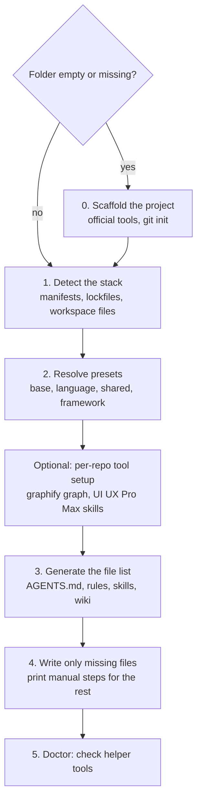

# Architecture

## In short
agent-initiator reads a repository, picks the matching rule bundles (presets), and writes instruction files for AI assistants. For an empty folder it first creates the project with official tools. Each step is a separate part of the code, so each can be tested on its own.

## Main flow

In words: if the folder is empty, the project is created first. Then the tool detects what the repository contains, combines the matching presets, optionally runs per-repository tool setup, builds the list of files to write, writes only the files that do not exist yet, and finally checks which helper tools are installed.

## Parts and where they live
| Part | What it does | Where |
|------|--------------|-------|
| CLI | Commands `init`, `list`, `doctor`, and the order of the steps | `src/cli.ts` |
| Questions | Interactive questions for new projects and preset choice | `src/prompts.ts` |
| Detection | Finds packages, languages, frameworks, package managers, monorepo tools, existing skills | `src/detect/` — see [stack detection](features/stack-detection.md) |
| Presets | Loads and checks preset folders, merges a preset chain | `src/presets/`, content in `presets/<id>/` — see [presets](features/presets.md) |
| Generation | Pure function: detected project + presets → files | `src/generate.ts`, `src/render/` — see [generated files](features/generated-files.md) |
| Writing | Creates missing files only, prints manual steps | `src/write/` |
| Scaffolding | Step lists per framework and layout, and the step runner | `src/scaffold/` — see [scaffolding](features/scaffolding.md) |
| Tool setup and doctor | Required tools, per-repo setup, machine check | `src/tooling.ts`, `src/setup.ts`, `src/doctor.ts` — see [tool setup](features/tool-setup.md) |

## Design decisions
| Decision | Why |
|----------|-----|
| Content lives in `presets/` (Markdown and JSON), not in code | Rules and skills can improve without touching TypeScript. |
| Generation and scaffold recipes are pure functions (no disk or process access) | Output is predictable and easy to unit-test; side effects live in `write/`, `scaffold/run.ts` and `cli.ts`. |
| Existing files are never overwritten | Safe to run on repositories with hand-written instructions. |
| `AGENTS.md` and `.agents/` are the source; `CLAUDE.md` and `.claude/skills/` are adapters | Most assistants read AGENTS.md and `.agents/skills`; Claude Code needs the adapter. |
| Framework knowledge points to version-matched docs | Assistants' training data goes stale; docs bundled with the installed version do not. |
| Official scaffolders, not our own app templates | New projects match each framework's current recommendations (only Express gets a minimal template). |

## Tests
| Test file | What it protects |
|-----------|------------------|
| `test/detect.test.ts`, `commands.test.ts`, `generate.test.ts`, `write.test.ts`, `scaffold.test.ts`, `run.test.ts`, `setup.test.ts` | Unit and snapshot tests per part |
| `test/cli.e2e.test.ts` | The built CLI against copies of the fixtures |
| `test/requirements.test.ts` | Every rule, skill and constraint agreed with the product owner stays in the output |
| `test/wiki.test.ts` | This wiki: every English page has an Indonesian twin, starts with In short, and is listed in the index |

Coverage: `rtk test pnpm run test:coverage` (the Definition of Done asks for at least 80% on changed code).
