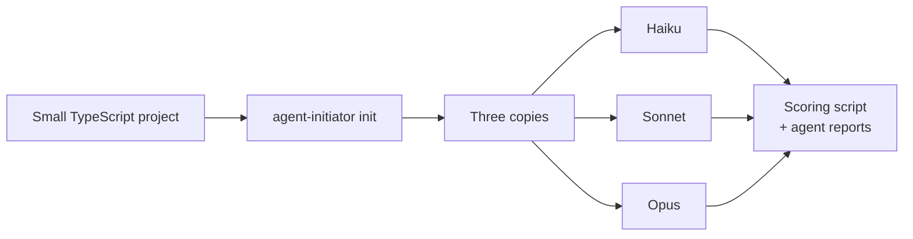

# Evaluation: do agents follow the generated instructions?

## In short
We gave three Claude models the same small task in a repository set up by agent-initiator and checked, file by file, which instructions they followed. The two larger models followed almost everything; the smallest one wrote good code but skipped the wiki and used the wrong commit format. The test also found four gaps in the generated instructions, listed at the end.

## Method
- **Repository:** a small TypeScript project (one module, Vitest, pnpm) with two commits, set up with `agent-initiator init --yes` on a machine with rtk, graphify, caveman and ponytail installed (2026-10-02, after TASK-7113).
- **Task, identical for every model:** "Add a function `slugify(text)` to src/utils.ts … Do it according to AGENTS.md. Do not commit; propose a commit message at the end." Agents could not ask questions, so they were told to write down what they would have asked and to assume plan approval.
- **Models:** Claude Haiku 4.5, Sonnet 5.5 and Opus 5.5, each as a separate sub-agent in its own copy of the repository, one run each.
- **Scoring:** a script checked commits, changed files, tests, typecheck, JSDoc and wiki changes; the commit message, questions and commands come from each agent's report.

## Results

| Check | Haiku 4.5 | Sonnet 5.5 | Opus 5.5 |
|-------|-----------|------------|----------|
| No commit or push | yes | yes | yes |
| Tests added and passing, typecheck passing | yes (16 tests) | yes (7 tests) | yes (6 tests) |
| Doc comment on the new function | yes | yes | yes |
| Wiki topic page in en and id, with In short and a diagram | **no (skipped)** | yes | yes |
| Index, glossary and log updated in both languages | **no** | yes | yes |
| Commit message `type(TASK-n): subject` | **no** (`feat(utils): …`) | yes (`TASK-1`) | yes (random `TASK-3618`, as plan-task says) |
| Asked for plan approval and stated assumptions | **no** | yes | yes |
| rtk prefix on the AGENTS.md commands | yes | yes | yes |
| rtk prefix on file and script commands (`cat >`, `mkdir`, `python3`) | n/a | **no** | **no** |
| Stayed in scope | added input validation nobody asked for | added accent folding | yes |
| Source lines added (code + tests) | 94 | 49 | 52 |
| Tokens / tool calls / time | 45.6k / 16 / 89 s | 64.6k / 8 / 56 s | 70.7k / 11 / 101 s |

In words: every model kept the hard limits (no commit, tests, doc comments, the rtk commands from AGENTS.md). The differences are in the process rules: Haiku treated the wiki as something done "with the commit" and skipped it, ignored the commit format and the plan step, even though AGENTS.md lists them under MUST. Sonnet and Opus followed the whole workflow, including a bilingual topic page with a diagram, and both listed what they would have asked.

## Gaps found in the generated instructions
1. **Coverage cannot be measured.** The Definition of Done asks for ≥ 80% coverage, but the project has no coverage command, so all three models reported it as "not measured". AGENTS.md does not say what to do then.
2. **rtk prefix on file and script commands is skipped.** Both larger models typed `cat >`, `mkdir` and `python3` without `rtk`, although AGENTS.md says "every shell command". The impact is small (few tokens), and Claude Code's rtk hook rewrites some of them.
3. **graphify was asked before the graph existed.** Opus followed Project knowledge and ran `graphify explain`, which failed because `graphify-out/` had not been built yet in a fresh setup.
4. **The smallest model skipped MUST items.** Writing them in AGENTS.md was not enough for Haiku; this is a model limit more than an instruction problem.

## Limits of this evaluation
- Claude models only; Codex, Gemini or Cursor were not tested.
- One task and one run per model, so this finds clear problems but is not a statistic.
- The sub-agents also saw the user's global Claude Code instructions (including RTK.md) and this repository's instructions, which may have helped them with rtk.

## Where it lives in the code
The evaluation is not part of the tool; this page records it. To repeat it: build the CLI, run `init --yes` in a small project, copy it once per model, give each model the task above and compare the results with the table.

## How to test it
Not automated. Repeat the steps in "Where it lives in the code" after changing presets or AGENTS.md rendering.
