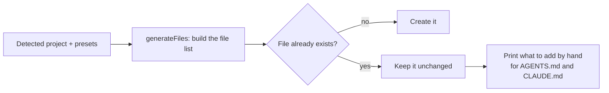

# Generated files

## In short
These are the files agent-initiator writes into a repository. `AGENTS.md` is the entry point every AI assistant reads; it links to the detailed rules and skills. Files that already exist are never overwritten.

## What gets written

```
AGENTS.md                         entry point: overview, commands, framework docs, required tools,
                                  MUST/NEVER constraints, Definition of Done, conventions, rule and skill index
CLAUDE.md                         "@AGENTS.md" so Claude Code reads the same instructions
.graphifyignore                   keeps the Indonesian wiki and change logs out of the graphify graph
.agents/agent-initiator.json      manifest: version, date, presets, tools and a hash of every file written
.agents/rules/*.md                detailed rules
.agents/skills/<name>/SKILL.md    skills (step-by-step guides)
.claude/skills/<name>/SKILL.md    copy of the skills for Claude Code
docs/wiki/{en,id}/                wiki skeleton: index, overview, getting-started, architecture, glossary, faq, log
<package>/AGENTS.md               monorepos and multi-folder repos: package-specific commands and rules
```

## How it works



In words: the file list is built in memory first. Each file is written only when it is missing. For an existing `AGENTS.md` or `CLAUDE.md`, the tool prints the sections you can add yourself.

## Details
- **Trace of an init.** Every run writes `.agents/agent-initiator.json` (like Copier's `.copier-answers.yml` or cruft's `.cruft.json`): the agent-initiator version, the date, the presets and installed tools, and a `sha256` hash of each file that run wrote (files that already existed are not listed, they are not ours). AGENTS.md's first comment names the version too: `<!-- Generated by agent-initiator v0.1.0 … -->`. On the next `init`, the tool says "Already initialised with agent-initiator v… on …", or, for repositories set up before the manifest existed, that an earlier version initialised it. The hashes let [`status`](upgrade-status.md) tell files nobody changed from files a person edited.
- AGENTS.md has a **Project knowledge** section that tells AI agents the cheapest way to learn the project: the English wiki first (`index.md`, then only the pages the task needs, no `log.md`), then graphify for structure questions, and grep last. Package AGENTS.md files point back to it.
- Commands come from the real `package.json` scripts and are prefixed with `rtk`. A missing `test` or `build` script is flagged in the Definition of Done instead of invented. A coverage script (`test:coverage`, `coverage`, `test:cov`) is used for the coverage step; without one, the step tells agents to use the runner's coverage option or report coverage as not measured.
- Next.js apps get the official `nextjs-agent-rules` block, so `next dev` leaves AGENTS.md alone.
- Skills already in `.agents/skills/` (for example Nx's official skills) are listed in AGENTS.md and copied to `.claude/skills/`. Rules other tools wrote into `.agents/rules/` (for example graphify or ponytail installers) are linked from AGENTS.md too, because Codex and Claude Code only read the rules AGENTS.md points to. Their own frontmatter decides how they are listed: `alwaysApply: true` or `trigger: always_on` → always, `globs` → for matching files, otherwise on demand (description from the frontmatter or the first heading). Empty files are skipped, a preset rule with the same name wins, and these files are never written or tracked in the manifest.
- The root AGENTS.md stays small: at most 12 KiB, about 2,500 tokens, because agents read it at the start of every session (a test checks every fixture; Codex's hard limit is 32 KiB). It lists rules and skills by name and keeps one usage line per required tool; install steps are in the generated rule `.agents/rules/required-tooling.md`, and each rule and skill carries its own description.

## Where it lives in the code
`src/generate.ts`, `src/render/agents-md.ts`, `src/render/commands.ts`, `src/render/tooling-rule.ts` (required-tooling rule), `src/render/manifest.ts` and `src/detect/initialised.ts` (manifest and init detection), `src/write/index.ts`.

## How to test it
`rtk test pnpm vitest run test/generate.test.ts test/write.test.ts`.
