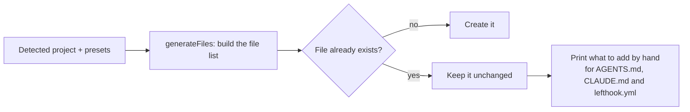

# Generated files

## In short
These are the files agent-initiator writes into a repository. `AGENTS.md` is the entry point every AI assistant reads; it links to the detailed rules and skills. Files that already exist are never overwritten.

## What gets written

```
AGENTS.md                         entry point: overview, commands, framework docs, required tools,
                                  MUST/NEVER constraints, Definition of Done, conventions, rule and skill index
CLAUDE.md                         "@AGENTS.md" so Claude Code reads the same instructions
.graphifyignore                   keeps the Indonesian wiki and change logs out of the graphify graph
lefthook.yml, .lefthook/          git hooks for every language: lint + message check on commit, typecheck + tests + wiki reminder on push
.github/workflows/ci.yml          GitHub Actions: lint → typecheck → test → build → audit per package
.gitlab-ci.yml                    instead, for GitLab remotes (or --ci gitlab); no CI file when the repo already has CI
.agents/rules/*.md                detailed rules
.agents/skills/<name>/SKILL.md    skills (step-by-step guides)
.claude/skills/<name>/SKILL.md    copy of the skills for Claude Code
docs/wiki/{en,id}/                wiki skeleton: index, overview, getting-started, architecture, glossary, faq, log
<package>/AGENTS.md               monorepos and multi-folder repos: package-specific commands and rules
```

## How it works



In words: the file list is built in memory first. Each file is written only when it is missing. For an existing `AGENTS.md`, `CLAUDE.md` or `lefthook.yml`, the tool prints the sections you can add yourself. Shell scripts (`.sh`) are written as executable, so git hooks run and no mode change shows up later.

## Details
- AGENTS.md has a **Project knowledge** section that tells AI agents the cheapest way to learn the project: the English wiki first (`index.md`, then only the pages the task needs, no `log.md`), then graphify for structure questions, and grep last. Package AGENTS.md files point back to it.
- Commands come from the real `package.json` scripts and are prefixed with `rtk`. A missing `test` or `build` script is flagged in the Definition of Done instead of invented.
- Next.js apps get the official `nextjs-agent-rules` block, so `next dev` leaves AGENTS.md alone.
- Skills already in `.agents/skills/` (for example Nx's official skills) are listed in AGENTS.md and copied to `.claude/skills/`.
- The root AGENTS.md stays under 32 KiB, the limit some assistants read.

## Where it lives in the code
`src/generate.ts`, `src/render/agents-md.ts`, `src/render/commands.ts`, `src/write/index.ts`.

## How to test it
`rtk test pnpm vitest run test/generate.test.ts test/write.test.ts`.
