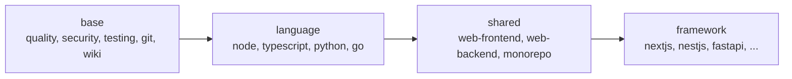

# Presets

## In short
A preset is a ready-made bundle of rules, step-by-step guides (skills), commands and constraints for one technology. agent-initiator stacks several presets — from general rules to framework-specific ones — so a Next.js app and a FastAPI service each get rules that fit them, on top of the same company-wide standards.

## How presets are layered

In words: every repository gets `base`. A language preset adds language rules, a shared preset adds frontend, backend or monorepo rules, and a framework preset adds the framework's own rules. Later layers can override commands, rules and skills with the same name.

## What a preset contains
| File | Content |
|------|---------|
| `presets/<id>/preset.json` | id, name, category, `extends`, commands, conventions, MUST/NEVER constraints, required tools, version-matched `docs` |
| `rules/*.md` | rule files with `description`, `globs` and `alwaysApply` |
| `skills/<name>/SKILL.md` | skills in the Agent Skills format |
| `files/` | files copied into the repository, such as the wiki skeleton |
| `agents-md.md` | a block copied word for word into AGENTS.md (used for the official Next.js block) |

## The base preset
Always included. It holds the standards agreed with the product owner: Karpathy-inspired LLM discipline, code quality (KISS, DRY, SOLID, no AI slop), naming, error handling and logging, security, architecture including scalability, testing (every function, coverage, mocking), git workflow (approval, one task = one commit, no attribution trailers), documentation (this wiki), dependencies, CI quality gates, observability, data privacy (UU PDP and GDPR) and release versioning. Run `agent-initiator list` to see every preset.

Not every rule is read on every task, to save tokens. `alwaysApply: true` rules (LLM discipline, code quality, naming, error handling and logging, security, testing, git workflow) are read before every task. Topic rules are read on demand, when the task matches their description: documentation (when updating the wiki), architecture (new or restructured modules), data privacy (personal data) and observability (services, logs, metrics). Their non-negotiable lines stay in AGENTS.md → MUST/NEVER, which is always read. Rules with `globs` apply to matching files.

## Where it lives in the code
`src/presets/registry.ts` loads and validates presets (skill names must match their folder); `src/presets/resolve.ts` merges a chain parent-first.

## How to test it
`rtk test pnpm vitest run test/presets.test.ts test/requirements.test.ts`.
