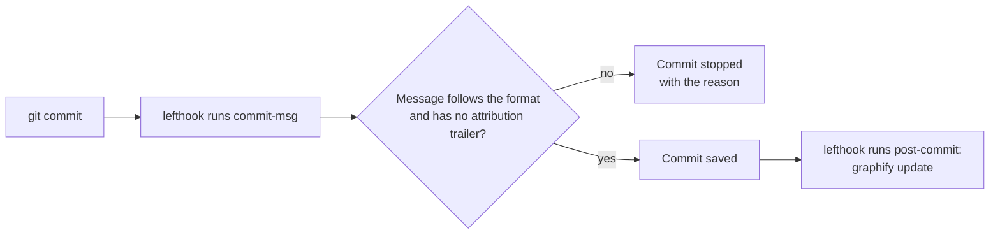

# Quality gates (git hooks)

## In short
A quality gate is an automatic check that stops a change when it breaks an agreed rule. agent-initiator adds git hooks that run on every commit, for any programming language: the commit message must follow the project format, and the code map used by AI assistants is refreshed. The hooks are run by lefthook, one small tool that works the same for JavaScript, Python, Go and others.

## What runs and when

| Moment | Check | Blocks the commit? |
|--------|-------|--------------------|
| `commit-msg` (after you write the message) | Header is `type(#123): subject` or `type(TASK-123): subject`, subject at most 72 characters, no `Co-Authored-By` trailer. Messages made by git itself (`Merge …`, `Revert …`) pass. | yes |
| `post-commit` (after the commit is saved) | `graphify update .` refreshes the code graph, only when graphify is a required tool | never |

In words: when you commit, lefthook runs `check-message.sh` on your message. A wrong message stops the commit and prints what is expected. A good message is saved, and then the code graph is refreshed in the background of the hook; that step never fails a commit. Nobody may skip the hooks with `--no-verify`: AGENTS.md lists it under NEVER.

## What init generates
- `lefthook.yml` — the hook list (rendered, because the graphify step depends on the required tools).
- `.lefthook/commit-msg/check-message.sh` — plain POSIX `sh`, so it needs no Node, Python or Go.
- AGENTS.md: lefthook under Required tooling (install with npm, uv, go or brew), a Project knowledge line, and the NEVER entry.

## Activating the hooks
Hooks live in `.git/` and are not committed, so each clone runs `lefthook install` once. `init` runs it for you (even with `--yes`) inside a git repo when lefthook is installed, unless `.husky/` or `.pre-commit-config.yaml` exists: those repos already have a hook manager, and init then prints the command instead. It runs after the files are written, because `lefthook install` without a `lefthook.yml` writes lefthook's own default config. If the repo already has a `lefthook.yml`, init keeps it and prints the `commit-msg` block to add by hand.

Order matters with graphify: run `graphify hook install` first, then `lefthook install`. lefthook moves graphify's post-commit hook aside (to `post-commit.old`) and runs graphify from `lefthook.yml` instead. The other way round, graphify appends to lefthook's hook and the graph is rebuilt twice per commit. Because of this, `doctor` checks graphify's post-checkout hook, which lefthook leaves alone.

## Where it lives in the code
| What | File |
|------|------|
| Hook list renderer | `src/render/lefthook.ts` |
| Commit message check | `presets/base/files/.lefthook/commit-msg/check-message.sh` |
| `lefthook.yml` added to the output | `src/generate.ts` |
| `lefthook install` setup step and its skip rule | `src/setup.ts` |
| Tool entry (install, usage) | `src/tooling.ts` |
| Rule text | `presets/base/rules/ci-quality-gates.md` |

## How to test it
`rtk test pnpm vitest run test/lefthook.test.ts test/setup.test.ts`. The message tests run the real script with `sh`, so they cover the exact regex git uses.
