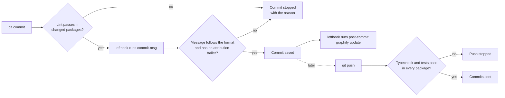

# Quality gates (git hooks)

## In short
A quality gate is an automatic check that stops a change when it breaks an agreed rule. agent-initiator adds git hooks for any programming language: before a commit the code is linted and the commit message must follow the project format; before a push the type check and tests must pass; and the code map used by AI assistants is refreshed after each commit. The hooks are run by lefthook, one small tool that works the same for JavaScript, Python, Go and others.

## What runs and when

| Moment | Check | Blocks? |
|--------|-------|---------|
| `pre-commit` (before the commit is made) | The package's `lint` command. In a multi-package repo each package has its own check, run inside that package and only when staged files are in it. | the commit |
| `commit-msg` (after you write the message) | Header is `type(#123): subject` or `type(TASK-123): subject`, subject at most 72 characters, no `Co-Authored-By` trailer. Messages made by git itself (`Merge …`, `Revert …`) pass. | the commit |
| `pre-push` (before commits are sent) | The `typecheck` and `test` commands of every package, each run inside its package | the push |
| `pre-push` | `check-wiki.sh`: a reminder when code changed but `docs/wiki/en/` did not ([details](wiki-knowledge-base.md#reminder-when-the-wiki-is-forgotten)) | never (warning only) |
| `post-commit` (after the commit is saved) | `graphify update .` refreshes the code graph, only when graphify is a required tool | never |

The commands are the same ones AGENTS.md lists, without the `rtk` prefix (hooks also run for people who do not use rtk). A package without a `lint`, `typecheck` or `test` command gets no check for it. `format` is left out on purpose: many format scripts rewrite files, and a hook must not change your code behind your back. lefthook does not filter pre-push commands by changed files, so every package is checked before a push, like CI does.

In words: when you commit, lefthook first runs lint in the packages you changed, then `check-message.sh` on your message. A wrong message stops the commit and prints what is expected. A good message is saved, and then the code graph is refreshed by the hook; that step never fails a commit. When you push, typecheck and tests must pass first. Nobody may skip the hooks with `--no-verify`: AGENTS.md lists it under NEVER.

## What init generates
- `lefthook.yml` — the hook list (rendered, because the checks depend on the detected packages and commands, and the graphify step on the required tools).
- `.lefthook/commit-msg/check-message.sh` and `.lefthook/pre-push/check-wiki.sh` — plain POSIX `sh`, so they need no Node, Python or Go.
- AGENTS.md: lefthook under Required tooling (install with npm, uv, go or brew), a Project knowledge line, and the NEVER entry.

## Activating the hooks
Hooks live in `.git/` and are not committed, so each clone runs `lefthook install` once. `init` runs it for you (even with `--yes`) inside a git repo when lefthook is installed, unless `.husky/` or `.pre-commit-config.yaml` exists: those repos already have a hook manager, and init then prints the command instead. It runs after the files are written, because `lefthook install` without a `lefthook.yml` writes lefthook's own default config. If the repo already has a `lefthook.yml`, init keeps it and prints the `commit-msg` block to add by hand.

Order matters with graphify: run `graphify hook install` first, then `lefthook install`. lefthook moves graphify's post-commit hook aside (to `post-commit.old`) and runs graphify from `lefthook.yml` instead. The other way round, graphify appends to lefthook's hook and the graph is rebuilt twice per commit. Because of this, `doctor` checks graphify's post-checkout hook, which lefthook leaves alone.

## Where it lives in the code
| What | File |
|------|------|
| Hook list renderer | `src/render/lefthook.ts` |
| Which task runs in which hook, per package | `hookChecks` in `src/generate.ts`, commands from `packageTaskCommands` in `src/render/commands.ts` |
| Commit message check | `presets/base/files/.lefthook/commit-msg/check-message.sh` |
| Wiki reminder (pre-push) | `presets/base/files/.lefthook/pre-push/check-wiki.sh` |
| `lefthook.yml` added to the output | `src/generate.ts` |
| `lefthook install` setup step and its skip rule | `src/setup.ts` |
| Tool entry (install, usage) | `src/tooling.ts` |
| Rule text | `presets/base/rules/ci-quality-gates.md` |

## How to test it
`rtk test pnpm vitest run test/lefthook.test.ts test/setup.test.ts test/check-wiki.test.ts`.
