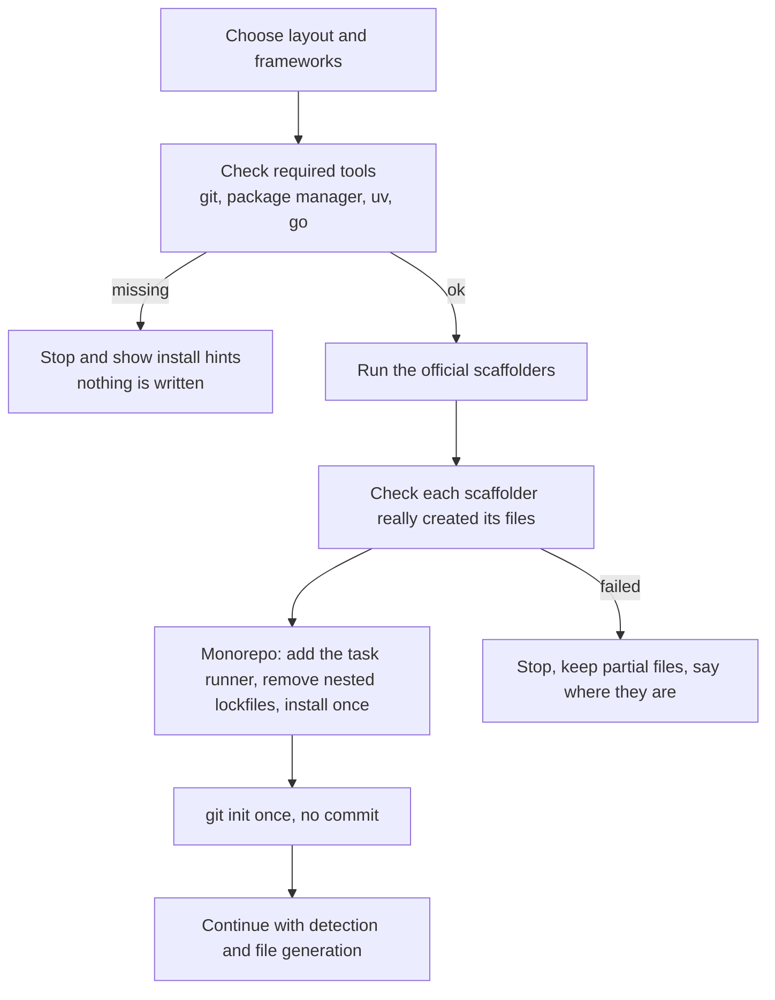

# Scaffolding new projects

## In short
When the folder is empty or does not exist, agent-initiator can create the project first — using each framework's official setup tool — and only then write the AI instructions. Single apps, frontend + backend folders and monorepos (Turborepo, Nx, moon, plain workspaces) are supported.

## How it works

In words: after you choose a layout and frameworks, the tool checks that the needed programs are installed. It runs the official scaffolders, verifies their output (some exit successfully even when they fail), finishes monorepo setup, runs `git init` once without committing, and then generates the AI instructions from the real result.

## Layouts and scaffolders
| Layout | Root | Apps |
|--------|------|------|
| `single` | — | the framework's scaffolder in the root |
| `folders` | plain folder | each app in its own folder, e.g. `web/` and `api/` |
| `turborepo` | root files + `turbo` | apps in `apps/<name>` |
| `nx` | `create-nx-workspace` | Nx generators (Vitest), other frameworks as plain folders |
| `moonrepo` | root files, `.moon/workspace.yml`, `@moonrepo/cli` | apps in `apps/<name>`, each with a `moon.yml` |
| `workspaces` | root files | apps in `apps/<name>` |

Frameworks: `nextjs`, `react-vite`, `vue-vite`, `nuxt`, `nestjs`, `express` (minimal TypeScript template), `fastify`, `hono`, `fastapi` and `django` (uv), `go-http` (go + Gin).

## moonrepo notes
- moon does not read package.json scripts, so each app gets a `moon.yml` that maps `build`, `test` and `lint` to the real commands.
- moon needs at least one git commit and the pinned tool versions (`moon setup`) before `moon run` works. The tool reminds you after scaffolding, because it never commits for you.

## Safety
- Only new or empty folders are scaffolded.
- Agent-detection variables (`CLAUDECODE`, `OPENCODE`) are removed so scaffolders behave as in a normal terminal; Nx's own agent files are removed but its official skills are kept.

## Where it lives in the code
`src/scaffold/recipes.ts` (pure step lists), `src/scaffold/run.ts` (runs steps), `src/scaffold/index.ts` (checks, git init, notes), `src/scaffold/templates.ts`, `src/scaffold/frameworks.ts`, `src/scaffold/flags.ts`.

## How to test it
Unit tests: `rtk test pnpm vitest run test/scaffold.test.ts test/run.test.ts`. Changes to scaffolders also need a real smoke run in a temporary folder, because scaffolder flags change between versions.
