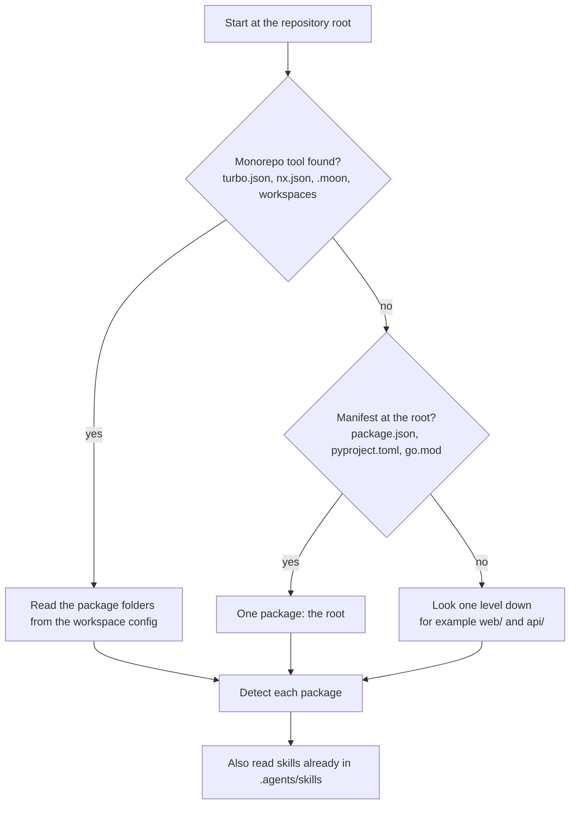

# Stack detection

## In short
Before writing anything, agent-initiator looks at the files in a repository to find out what it is built with: which languages, frameworks, package managers and monorepo tool. That decides which rules and commands the AI assistant gets.

## How it works

In words: first look for a monorepo tool; if there is one, its config lists the package folders. Otherwise a manifest at the root means a single-package repository. Otherwise each sub-folder with a manifest becomes a package (for example `web/` and `api/` in a fullstack repository). Every package is then detected on its own.

## What is detected per package
| Signal | Result |
|--------|--------|
| `next`, `nuxt`, `react`+`vite`, `vue`+`vite` in package.json | presets `nextjs`, `nuxt`, `react-vite`, `vue-vite` |
| `@nestjs/core`, `express`, `fastify`, `hono` | presets `nestjs`, `express`, `fastify`, `hono` |
| `typescript` dependency or `tsconfig.json` | `typescript`, otherwise `node` |
| `pyproject.toml` or `requirements.txt` mentioning FastAPI or Django | `python` plus `fastapi` or `django` |
| No manifest, but `.py` files or `tests/test_*.py` at the repository root | `python`, with only build (`python3 -m compileall`) and test commands: `python3 -m pytest` when the tests import pytest, otherwise `python3 -m unittest discover`. Nothing declares dependencies, so there is no install, lint, typecheck or audit command. Only the root counts, so a `scripts/` folder of `.py` files in another stack is not a package. |
| `go.mod` (plus gin, echo, chi or fiber) | `go` (plus `go-http`) |
| Lockfile (`pnpm-lock.yaml`, `yarn.lock`, `bun.lock`, `uv.lock`, `poetry.lock`, …) | the package manager |
| `package.json` scripts | the real commands shown in AGENTS.md |

## Monorepo tools
| Tool | Detected from | Notes |
|------|---------------|-------|
| Turborepo | `turbo.json` | package folders from pnpm-workspace.yaml or package.json `workspaces` |
| Nx | `nx.json` | Nx projects without scripts get `nx run <project>:<task>` commands |
| moonrepo | `.moon/` or `.config/moon/` | folders from `.moon/workspace.yml`; commands use moon project IDs (map key or folder name), not package.json names |
| Plain workspaces | pnpm-workspace.yaml or package.json `workspaces` | — |

## Where it lives in the code
`src/detect/index.ts` (order of checks), `node.ts`, `python.ts`, `go.ts`, `workspace.ts`, `package-manager.ts`, `skills.ts`.

## How to test it
`rtk test pnpm vitest run test/detect.test.ts` — one fixture per stack lives in `test/fixtures/`.
