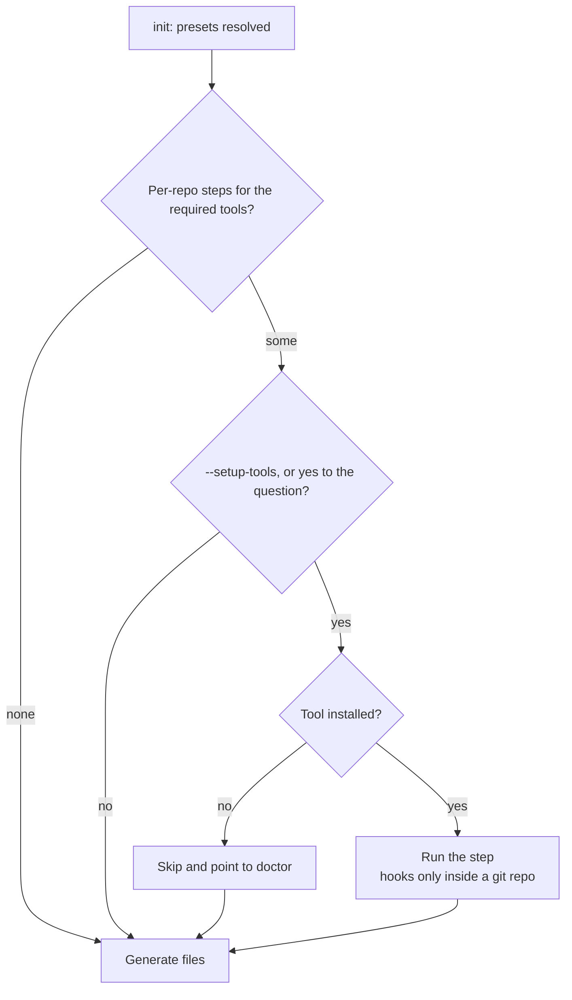

# Required tools, doctor and per-repo setup

## In short
The generated instructions ask AI assistants and developers to use five helper tools. Most of them are installed once per computer and then work everywhere; two need a small step in each repository. agent-initiator checks them and can run those per-repository steps, but it never installs anything by itself.

## The tools
| Tool | What it is for | After the one-time install | Per-repository step |
|------|----------------|----------------------------|---------------------|
| rtk | shortens command output | automatic (global hook) | none |
| caveman | short answers from the assistant | automatic in Claude Code | none |
| ponytail | smallest working code | automatic in Claude Code | none |
| graphify | searchable map of the code | skill available | `graphify update .`, optional `graphify hook install` |
| UI UX Pro Max (frontend only) | design guidance | CLI available | `uipro init --ai universal` and `--ai claude` |

## How setup works

In words: after the presets are known, the tool lists the per-repository steps. It runs them with `--setup-tools` or when you agree to the question. In `--yes` mode without `--setup-tools`, only the graphify git hooks run, and only when `.gitattributes` does not exist yet (graphify appends to that file, and existing files are never changed without asking); otherwise the tool prints the command to run yourself. A missing tool is skipped (never installed), git hooks are only installed inside a git repository, and a failing step prints a warning without stopping `init`. Setup runs before file generation so the UI UX Pro Max skills are listed in AGENTS.md.

## Using graphify cheaply
- `graphify update .` builds the code graph from the code alone (no LLM, no tokens); the git hooks keep it current.
- The full `/graphify` extraction reads documents with an LLM and is expensive; run it only occasionally, because the English wiki already explains the concepts.
- Ask with symbol names and a budget: `graphify affected "detectWorkspace"` lists what a change would touch in about 140 tokens; `graphify path "runInit" "moonProjectConfig"` shows the call chain in one line. Broad questions return noise.
- `.graphifyignore` (generated by `init`) keeps `docs/wiki/id/` and the change logs out of the graph.

## Doctor
`agent-initiator doctor` prints a check or cross per tool, with install commands for the missing ones. Its exit code is 1 when a tool is missing, so it can run in CI. Inside a git repository it also reports whether the graphify git hooks are installed; missing hooks are only a warning, because CI clones never have them.

After cloning a repository, each contributor runs `graphify hook install` once (hooks live in `.git/` and are not committed). The generated getting-started page and AGENTS.md → Project knowledge both say so.

## Where it lives in the code
`src/tooling.ts` (the tool list and texts), `src/setup.ts` (per-repo steps), `src/doctor.ts` (machine check).

## How to test it
`rtk test pnpm vitest run test/setup.test.ts`.
