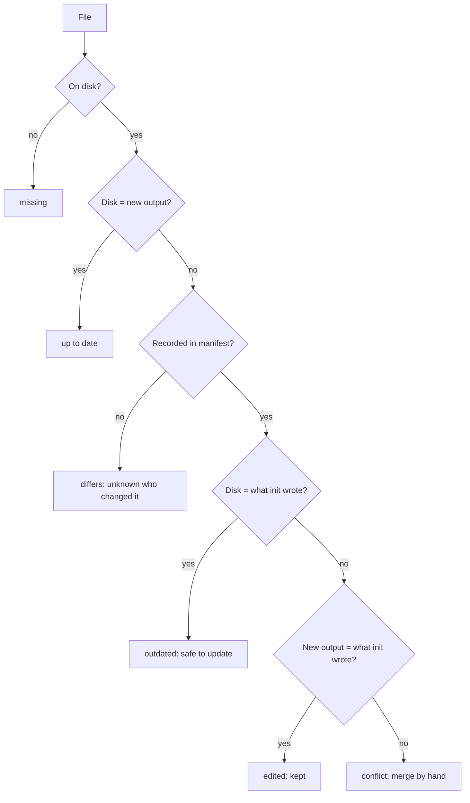

# Status: is a repository behind the current version?

## In short
`agent-initiator status` tells you which of the files `init` wrote are out of date with the version you have now, without changing anything. It knows the difference between a file nobody touched (safe to update) and a file someone edited (keep it), because `init` records a fingerprint of every file it writes. It exits with code 1 when something needs attention, so it can also run in CI.

## How it works
`init` writes `.agents/agent-initiator.json` (see [generated files](generated-files.md)) with a `sha256` hash of each file it wrote. `status` regenerates everything in memory, using the date and tools recorded in that manifest so the comparison is fair, and compares three things per file: what init wrote (A), what is on disk (B) and what this version generates (C). The version number alone is not enough: the content can change while the version stays the same.

In words: a missing file is reported first. A file that already matches the new output is up to date, whoever changed it. Without a record (a file the user already had, or a repository set up before the manifest existed) only "same or different" can be known. With a record, an untouched file is outdated when the template changed, an edited file is kept when the template did not change, and a file changed on both sides is a conflict. Files the manifest lists but this version no longer generates (for example an old `lefthook.yml`) are reported as obsolete; nothing is deleted.

| State | Meaning | Exit code |
|-------|---------|-----------|
| up to date | matches what this version generates | 0 |
| edited | you changed it; the template did not | 0 |
| differs | no record of what init wrote | 0 |
| obsolete | no longer generated; review and delete it yourself | 0 |
| outdated | untouched by you; the template changed | 1 |
| conflict | changed by you and by the template | 1 |
| missing | generated but not on disk | 1 |

For outdated, conflict and differs files, `status` writes the new content to a temp folder outside the repository and prints a `git diff --no-index -- <file> <new>` command to see the difference. Tools installed after init are listed but left out of the comparison.

## Where it lives in the code
| What | File |
|------|------|
| The three-way comparison | `classifyFiles` in `src/status.ts` |
| The `status` command (regenerate, read disk, print) | `runStatus` in `src/cli.ts` |
| Reading and checking the manifest | `readManifest` in `src/detect/initialised.ts` |
| Hashes | `contentHash` in `src/render/manifest.ts` |

## How to test it
`rtk test pnpm vitest run test/status.test.ts test/cli.e2e.test.ts`. By hand: `agent-initiator init <dir> --yes`, then `agent-initiator status <dir>` (all up to date), edit a rule and run it again.
