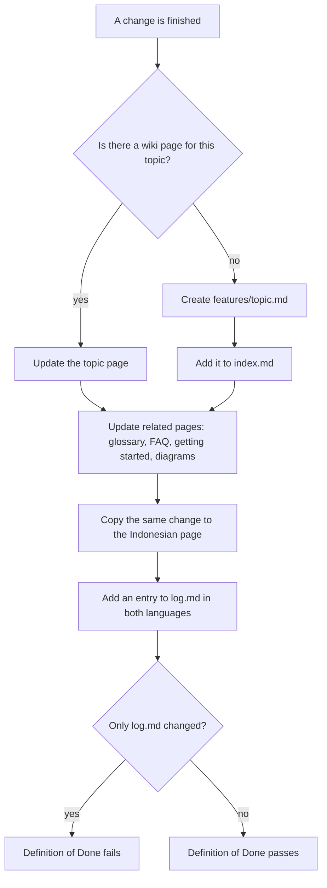

# Wiki as a knowledge base

## In short
Every project set up by agent-initiator keeps a wiki in English and Indonesian. It explains the project so that anyone — a new developer, an experienced developer, or someone who does not write code — can understand it without asking. Whenever something changes, the page about that topic is updated too, so the wiki never falls behind the code.

## How it works



In words: when a change is finished, the agent looks for the wiki page about that topic. If there is none, it creates one and lists it in `index.md`. It then updates related pages, mirrors everything to Indonesian and adds a log entry. If only the log changed, the Definition of Done does not pass.

## Reminder when the wiki is forgotten
Rules are easy to forget, so a small script checks it before every push:

```
code changed? ──no──▶ fine
     │ yes
docs/wiki/en/ changed too? ──yes──▶ fine
     │ no
a commit says "Wiki: not needed (<reason>)"? ──yes──▶ fine
     │ no
     ▼
warning (the push still goes through)
```

In words: files under `docs/` and Markdown files are not code; anything else is. When code changed but no English wiki page did, the script prints a warning that points to the `update-wiki` skill. Some changes truly need no wiki update, such as a dependency bump or a CI tweak; then one commit message gets a line like `Wiki: not needed (dependency bump only)`. It is a reminder, not a gate: it never blocks a push or a merge, because only a person can judge whether a page is really needed.

## Rules and skills
- The rule `documentation` (in `.agents/rules/`) tells AI agents and people how to write and maintain the wiki:
  - every page starts with an **In short** section in everyday language, followed by details for developers;
  - the wiki has a fixed structure: `index`, `overview`, `getting-started`, `architecture`, `features/<topic>`, `glossary`, `faq`, `adr/` and `log`;
  - **every change updates the page of the topic it touches**; if no page exists yet, a new `features/<topic>.md` is created. A log entry alone is never enough;
  - pages that describe a flow, process or architecture get a diagram — Mermaid by default, ASCII for simple flows.
- The wiki is written for AI agents too: they read the English pages only, start from the task → page table in `index.md`, and use the "Where it lives in the code" tables to jump to files. AGENTS.md → Project knowledge sends them here before they explore the code.
- The skill `update-wiki` is the step-by-step workflow: find or create the topic page, update related pages (glossary, FAQ, getting started), mirror English to Indonesian, update `index.md`, add a `log.md` entry.
- The Definition of Done (in `AGENTS.md` and the `definition-of-done` skill) does not pass when only the log was updated.
- `agent-initiator init` creates the starting pages in both languages (only when they do not exist yet): `index` with reading paths for non-developers, new developers and experienced developers, `overview`, `getting-started`, `architecture` with an example Mermaid diagram, `glossary`, `faq` and `log`. Each page starts with *In short* and says what to write there.

## Where it lives in the code
| What | Where |
|------|-------|
| Rule text | `presets/base/rules/documentation.md` |
| Workflow | `presets/base/skills/update-wiki/SKILL.md` |
| Definition of Done line in generated AGENTS.md | `src/render/agents-md.ts` (`dodSection`) |
| Starting pages for new repositories | `presets/base/files/docs/wiki/{en,id}/` |
| Reminder script (pre-push) | `presets/base/files/.lefthook/pre-push/check-wiki.sh`, tested in `test/check-wiki.test.ts` |
| Guards that keep these rules from disappearing | `test/requirements.test.ts` |
| Guard for this repository's own wiki (twins, In short, index, diagrams, log entries outside the format example) | `test/wiki.test.ts` |

## How to check it
Run `rtk test pnpm run test` — the requirement tests fail if the rule, the skill or the Definition of Done lose the "topic page, not only the log" requirement.
