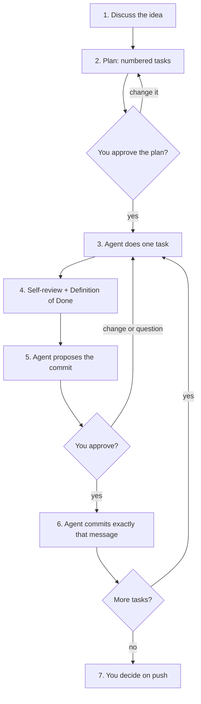

# The human–agent workflow

## In short
The rules and skills that agent-initiator generates make an AI agent work in a fixed loop: discuss, plan, do one task, check it, ask for approval, commit, then the next task. The agent does the work; a person decides what to build, approves the plan and approves every commit and push. This page explains the loop and which rule or skill drives each step; the [README](../../../../README.md#working-with-an-agent-the-humanagent-loop) shows an example of a planned task and of an approval request.

## The loop

In words: the agent first discusses the idea and asks about anything unclear, without writing code. It then proposes a plan of small, numbered tasks with acceptance checks; you approve or change it. For each task it writes the code, tests, doc comments and wiki page, reviews its own diff and runs the Definition of Done. It then stops and shows what changed, what it verified and the exact commit message. Only after your approval does it commit, with exactly that message, and move to the next task. Pushing always needs its own approval.

## What a good approval request contains
- What changed, in plain words.
- What was verified, with real numbers: tests, coverage, build, smoke runs.
- What was found on the way (and fixed or not), and what could not be checked.
- The files and the exact commit message: `type(TASK-n): subject`, a body that says why, no attribution trailers.

## Where it lives in the code
| Step | Rule or skill | File in a generated repository | Source in this repository |
|------|---------------|--------------------------------|---------------------------|
| Discuss | rule `llm-discipline` | `.agents/rules/llm-discipline.md` | `presets/base/rules/llm-discipline.md` |
| Plan | skill `plan-task` | `.agents/skills/plan-task/SKILL.md` | `presets/base/skills/plan-task/` |
| Check | skills `self-review`, `definition-of-done` | `.agents/skills/…` | `presets/base/skills/` |
| Ask and commit | skill `commit`, rule `git-workflow` | `.agents/skills/commit/`, `.agents/rules/git-workflow.md` | `presets/base/skills/commit/`, `presets/base/rules/git-workflow.md` |
| The MUST/NEVER lines (approval, one task = one commit) | AGENTS.md → Constraints | `AGENTS.md` | `presets/base/preset.json` |

## How to test it
`rtk test pnpm vitest run test/requirements.test.ts` guards the rules and skills this loop depends on (approval before commit and push, one task = one commit, plan-task with task numbers). The loop itself is checked by using it; see [the evaluation](evaluation.md) for how well different models follow it.
