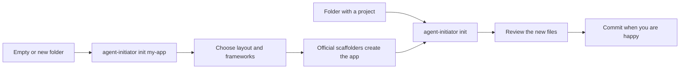

# Getting started

## In short
How to install agent-initiator from this repository, run it on a project, and make your first change to the tool itself.

## Requirements
- Node.js 20 or newer and pnpm.
- Git.
- The required helper tools listed in `AGENTS.md` (rtk, graphify, caveman, ponytail; UI UX Pro Max for frontend work). `agent-initiator doctor` checks them.
- For scaffolding Python or Go apps: `uv` or `go`.

## Install the command
The package is not published to npm yet, so install it from a clone:

```bash
rtk git clone git@github.com:RedLucky/agent-initiator.git
cd agent-initiator
rtk pnpm install
rtk pnpm run build
pnpm setup          # once, if pnpm reports ERR_PNPM_NO_GLOBAL_BIN_DIR
rtk pnpm link --global
```

After `source ~/.bashrc` (or a new terminal) the `agent-initiator` command works in any folder. The link points at your clone, so after a code change `rtk pnpm run build` is enough.

## Use it



```bash
cd my-existing-app && agent-initiator init           # add AI instructions to an existing project
agent-initiator init my-new-app                        # create a new project first (asks questions)
agent-initiator init my-app --framework nextjs --yes   # same, without questions
agent-initiator doctor                                 # check the helper tools on this machine
```

`init` creates files relative to the folder your terminal is in. Run it from the parent folder (or pass a full path) if the project should live elsewhere.

## Test
```bash
rtk test pnpm run test            # all tests
rtk test pnpm run test:coverage   # tests with coverage (Definition of Done needs >= 80% on changed code)
rtk err pnpm run typecheck
rtk err pnpm run build
```

## Your first change to the tool
1. Plan the task with the `plan-task` skill and get it approved.
2. Change the code with unit tests and plain-language doc comments for every function.
3. Update the wiki page of the topic you changed (create one in `features/` if it is missing), in English and Indonesian.
4. Run the `self-review` and `definition-of-done` skills.
5. Ask for approval, then commit one task per commit with the `commit` skill.
