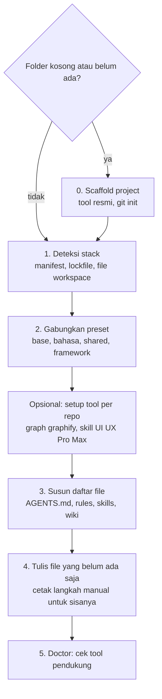

# Arsitektur

## Singkatnya
agent-initiator membaca sebuah repository, memilih paket aturan (preset) yang cocok, lalu menulis file instruksi untuk AI assistant. Untuk folder kosong, project dibuat dulu dengan tool resmi. Setiap langkah adalah bagian kode yang terpisah, sehingga masing-masing bisa dites sendiri.

## Alur utama

Dengan kata-kata: kalau foldernya kosong, project dibuat dulu. Lalu tool mendeteksi isi repository, menggabungkan preset yang cocok, menjalankan setup tool per repository kalau diminta, menyusun daftar file, menulis hanya file yang belum ada, dan terakhir mengecek tool pendukung mana yang sudah terinstal.

## Bagian dan letaknya
| Bagian | Fungsinya | Letak |
|--------|-----------|-------|
| CLI | Command `init`, `list`, `doctor`, dan urutan langkahnya | `src/cli.ts` |
| Pertanyaan | Pertanyaan interaktif untuk project baru dan pilihan preset | `src/prompts.ts` |
| Deteksi | Menemukan package, bahasa, framework, package manager, tool monorepo, skill yang sudah ada | `src/detect/` — lihat [deteksi stack](features/stack-detection.md) |
| Preset | Memuat dan mengecek folder preset, menggabungkan rantai preset | `src/presets/`, isi di `presets/<id>/` — lihat [preset](features/presets.md) |
| Generate | Pure function: project hasil deteksi + preset → daftar file | `src/generate.ts`, `src/render/` — lihat [file yang dihasilkan](features/generated-files.md) |
| Menulis | Hanya membuat file yang belum ada, mencetak langkah manual | `src/write/` |
| Scaffolding | Daftar langkah per framework dan layout, serta runner-nya | `src/scaffold/` — lihat [scaffolding](features/scaffolding.md) |
| Setup tool dan doctor | Tool wajib, setup per repo, cek mesin | `src/tooling.ts`, `src/setup.ts`, `src/doctor.ts` — lihat [setup tool](features/tool-setup.md) |

## Keputusan desain
| Keputusan | Alasan |
|-----------|--------|
| Isi aturan ada di `presets/` (Markdown dan JSON), bukan di kode | Rules dan skills bisa diperbaiki tanpa menyentuh TypeScript. |
| Generate dan resep scaffold adalah pure function (tanpa akses disk atau proses) | Output bisa diprediksi dan mudah di-unit-test; efek samping ada di `write/`, `scaffold/run.ts` dan `cli.ts`. |
| File yang sudah ada tidak pernah ditimpa | Aman dijalankan di repository yang sudah punya instruksi tulisan tangan. |
| `AGENTS.md` dan `.agents/` adalah sumbernya; `CLAUDE.md` dan `.claude/skills/` adalah adapter | Sebagian besar assistant membaca AGENTS.md dan `.agents/skills`; Claude Code butuh adapter. |
| Pengetahuan framework menunjuk ke docs yang sesuai versi terpasang | Data training assistant cepat usang; docs bawaan versi terpasang tidak. |
| Scaffolder resmi, bukan template app buatan sendiri | Project baru mengikuti rekomendasi terbaru setiap framework (hanya Express yang memakai template minimal). |

## Test
| File test | Yang dijaga |
|-----------|-------------|
| `test/detect.test.ts`, `commands.test.ts`, `generate.test.ts`, `write.test.ts`, `scaffold.test.ts`, `run.test.ts`, `setup.test.ts` | Unit test dan snapshot test per bagian |
| `test/cli.e2e.test.ts` | CLI hasil build dijalankan pada salinan fixture |
| `test/requirements.test.ts` | Setiap rule, skill dan batasan yang disepakati dengan product owner tetap ada di output |
| `test/wiki.test.ts` | Wiki ini: setiap halaman Inggris punya pasangan Indonesia, dibuka dengan Singkatnya, dan terdaftar di index |

Coverage: `rtk test pnpm run test:coverage` (Definition of Done meminta minimal 80% pada kode yang berubah).
