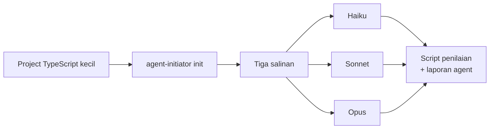

# Evaluasi: apakah agent mengikuti instruksi yang dibuat?

## Singkatnya
Kami memberi tiga model Claude tugas kecil yang sama di repository yang disiapkan agent-initiator, lalu mengecek file demi file instruksi mana yang mereka ikuti. Dua model yang lebih besar mengikuti hampir semuanya; model terkecil menulis kode yang baik tetapi melewati wiki dan memakai format commit yang salah. Pengujian ini juga menemukan empat celah di instruksi yang dibuat, dicantumkan di bagian akhir.

## Metode
- **Repository:** project TypeScript kecil (satu modul, Vitest, pnpm) dengan dua commit, disiapkan dengan `agent-initiator init --yes` di mesin yang sudah memasang rtk, graphify, caveman dan ponytail (2026-10-02, setelah TASK-7113).
- **Tugas, sama untuk setiap model:** "Add a function `slugify(text)` to src/utils.ts … Do it according to AGENTS.md. Do not commit; propose a commit message at the end." Agent tidak bisa bertanya, jadi mereka diminta menuliskan apa yang akan ditanyakan dan menganggap rencana disetujui.
- **Model:** Claude Haiku 4.5, Sonnet 5.5 dan Opus 5.5, masing-masing sebagai sub-agent terpisah di salinan repository-nya sendiri, satu kali jalan.
- **Penilaian:** sebuah script mengecek commit, file yang berubah, test, typecheck, JSDoc dan perubahan wiki; pesan commit, pertanyaan dan perintah diambil dari laporan setiap agent.

## Hasil

| Cek | Haiku 4.5 | Sonnet 5.5 | Opus 5.5 |
|-----|-----------|------------|----------|
| Tidak commit atau push | ya | ya | ya |
| Test ditambah dan lolos, typecheck lolos | ya (16 test) | ya (7 test) | ya (6 test) |
| Doc comment di fungsi baru | ya | ya | ya |
| Halaman topik wiki en dan id, dengan Singkatnya dan diagram | **tidak (dilewati)** | ya | ya |
| Index, glossary dan log diperbarui di kedua bahasa | **tidak** | ya | ya |
| Pesan commit `type(TASK-n): subject` | **tidak** (`feat(utils): …`) | ya (`TASK-1`) | ya (acak `TASK-3618`, sesuai plan-task) |
| Meminta persetujuan rencana dan menyebut asumsi | **tidak** | ya | ya |
| Awalan rtk di command AGENTS.md | ya | ya | ya |
| Awalan rtk di perintah file dan script (`cat >`, `mkdir`, `python3`) | n/a | **tidak** | **tidak** |
| Tetap di dalam scope | menambah validasi input yang tidak diminta | menambah penghapusan aksen | ya |
| Baris source yang ditambah (kode + test) | 94 | 49 | 52 |
| Token / tool call / waktu | 45,6k / 16 / 89 dtk | 64,6k / 8 / 56 dtk | 70,7k / 11 / 101 dtk |

Dengan kata-kata: setiap model menjaga batasan keras (tidak commit, test, doc comment, command rtk dari AGENTS.md). Perbedaannya ada di aturan proses: Haiku menganggap wiki dikerjakan "bersama commit" lalu melewatinya, serta mengabaikan format commit dan langkah rencana, walaupun AGENTS.md mencantumkannya di MUST. Sonnet dan Opus mengikuti seluruh alur kerja, termasuk halaman topik dua bahasa dengan diagram, dan keduanya menuliskan apa yang akan mereka tanyakan.

## Celah yang ditemukan di instruksi yang dibuat
1. **Coverage tidak bisa diukur.** Definition of Done meminta coverage ≥ 80%, tetapi project tidak punya command coverage, sehingga ketiga model melaporkan "tidak diukur". AGENTS.md tidak menjelaskan apa yang harus dilakukan dalam kondisi itu.
2. **Awalan rtk di perintah file dan script terlewat.** Kedua model besar mengetik `cat >`, `mkdir` dan `python3` tanpa `rtk`, walaupun AGENTS.md menyebut "every shell command". Dampaknya kecil (sedikit token), dan hook rtk di Claude Code menulis ulang sebagian perintah itu.
3. **graphify ditanya sebelum graph-nya ada.** Opus mengikuti Project knowledge dan menjalankan `graphify explain`, yang gagal karena `graphify-out/` belum dibangun di setup yang baru.
4. **Model terkecil melewati butir MUST.** Menuliskannya di AGENTS.md belum cukup untuk Haiku; ini lebih merupakan batas model daripada masalah instruksi.

## Batasan evaluasi ini
- Hanya model Claude; Codex, Gemini atau Cursor tidak diuji.
- Satu tugas dan satu kali jalan per model, jadi ini menemukan masalah yang jelas tetapi bukan statistik.
- Sub-agent juga melihat instruksi global Claude Code milik pengguna (termasuk RTK.md) dan instruksi repository ini, yang mungkin membantu mereka soal rtk.

## Letaknya di kode
Evaluasi ini bukan bagian dari tool; halaman ini mencatatnya. Untuk mengulang: build CLI, jalankan `init --yes` di project kecil, salin sekali per model, beri setiap model tugas di atas lalu bandingkan hasilnya dengan tabel.

## Cara mengetesnya
Tidak otomatis. Ulangi langkah di "Letaknya di kode" setelah mengubah preset atau rendering AGENTS.md.
