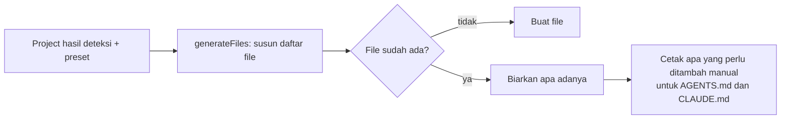

# File yang dihasilkan

## Singkatnya
Ini adalah file-file yang ditulis agent-initiator ke sebuah repository. `AGENTS.md` adalah pintu masuk yang dibaca setiap AI assistant; isinya menautkan ke rule dan skill yang lebih rinci. File yang sudah ada tidak pernah ditimpa.

## Apa yang ditulis

```
AGENTS.md                         pintu masuk: gambaran, command, docs framework, tool wajib,
                                  batasan MUST/NEVER, Definition of Done, konvensi, indeks rule dan skill
CLAUDE.md                         "@AGENTS.md" supaya Claude Code membaca instruksi yang sama
.graphifyignore                   mengeluarkan wiki bahasa Indonesia dan log perubahan dari graph graphify
.agents/rules/*.md                rule yang rinci
.agents/skills/<nama>/SKILL.md    skill (panduan langkah demi langkah)
.claude/skills/<nama>/SKILL.md    salinan skill untuk Claude Code
docs/wiki/{en,id}/                kerangka wiki: index, overview, getting-started, architecture, glossary, faq, log
<package>/AGENTS.md               monorepo dan repo multi-folder: command dan rule khusus package
```

## Cara kerjanya



Dengan kata-kata: daftar file disusun dulu di memori. Setiap file hanya ditulis kalau belum ada. Untuk `AGENTS.md` atau `CLAUDE.md` yang sudah ada, tool mencetak bagian yang bisa Anda tambahkan sendiri.

## Detail
- AGENTS.md punya bagian **Project knowledge** yang memberi tahu AI agent cara paling hemat mempelajari project: wiki bahasa Inggris dulu (`index.md`, lalu hanya halaman yang dibutuhkan task, tanpa `log.md`), lalu graphify untuk pertanyaan struktur, dan grep paling akhir. AGENTS.md per package menunjuk balik ke bagian ini.
- Command diambil dari script `package.json` yang sebenarnya dan diberi prefix `rtk`. Script `test` atau `build` yang tidak ada ditandai di Definition of Done, bukan dikarang.
- App Next.js mendapat blok resmi `nextjs-agent-rules`, sehingga `next dev` tidak mengubah AGENTS.md.
- Skill yang sudah ada di `.agents/skills/` (misalnya skill resmi Nx) didaftarkan di AGENTS.md dan disalin ke `.claude/skills/`.
- AGENTS.md di root dijaga tetap kecil: maksimal 12 KiB, sekitar 2.500 token, karena agent membacanya di awal setiap sesi (sebuah test mengecek setiap fixture; batas keras Codex 32 KiB). AGENTS.md mencantumkan rule dan skill berdasarkan nama dan satu baris cara pakai per tool wajib; langkah instalasi ada di rule hasil generate `.agents/rules/required-tooling.md`, dan setiap rule dan skill membawa deskripsinya sendiri.

## Letaknya di kode
`src/generate.ts`, `src/render/agents-md.ts`, `src/render/commands.ts`, `src/render/tooling-rule.ts` (rule required-tooling), `src/write/index.ts`.

## Cara mengeceknya
`rtk test pnpm vitest run test/generate.test.ts test/write.test.ts`.
