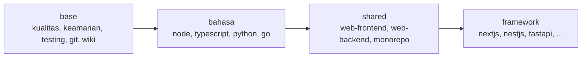

# Preset

## Singkatnya
Preset adalah paket siap pakai berisi aturan, panduan langkah demi langkah (skill), command dan batasan untuk satu teknologi. agent-initiator menumpuk beberapa preset — dari aturan umum sampai aturan khusus framework — sehingga app Next.js dan service FastAPI masing-masing mendapat aturan yang cocok, di atas standar perusahaan yang sama.

## Bagaimana preset ditumpuk

Dengan kata-kata: setiap repository mendapat `base`. Preset bahasa menambah aturan bahasa, preset shared menambah aturan frontend, backend atau monorepo, dan preset framework menambah aturan framework itu sendiri. Lapisan yang lebih belakang bisa menimpa command, rule dan skill dengan nama yang sama.

## Isi sebuah preset
| File | Isi |
|------|-----|
| `presets/<id>/preset.json` | id, nama, kategori, `extends`, command, konvensi, batasan MUST/NEVER, tool wajib, `docs` sesuai versi |
| `rules/*.md` | file rule dengan `description`, `globs` dan `alwaysApply` |
| `skills/<nama>/SKILL.md` | skill dalam format Agent Skills |
| `files/` | file yang disalin ke repository, seperti kerangka wiki |
| `agents-md.md` | blok yang disalin apa adanya ke AGENTS.md (dipakai untuk blok resmi Next.js) |

## Preset base
Selalu ikut. Berisi standar yang disepakati dengan product owner: disiplin LLM ala Karpathy, kualitas kode (KISS, DRY, SOLID, tanpa AI slop), penamaan, error handling dan logging, keamanan, arsitektur termasuk skalabilitas, testing (setiap function, coverage, mocking), alur git (persetujuan, satu task satu commit, tanpa trailer atribusi), dokumentasi (wiki ini), dependency, quality gate CI, observability, privasi data (UU PDP dan GDPR) dan versioning rilis. Jalankan `agent-initiator list` untuk melihat semua preset.

Tidak semua rule dibaca di setiap tugas, demi menghemat token. Rule `alwaysApply: true` (disiplin LLM, kualitas kode, penamaan, error handling dan logging, keamanan, testing, alur git) dibaca sebelum setiap tugas. Rule topik dibaca saat dibutuhkan, ketika tugasnya cocok dengan deskripsinya: documentation (saat mengupdate wiki), architecture (modul baru atau yang distruktur ulang), data privacy (data pribadi) dan observability (service, log, metric). Baris yang tidak boleh dilanggar dari rule-rule itu tetap ada di AGENTS.md → MUST/NEVER, yang selalu dibaca. Rule dengan `globs` berlaku untuk file yang cocok.

## Letaknya di kode
`src/presets/registry.ts` memuat dan mengecek preset (nama skill harus sama dengan foldernya); `src/presets/resolve.ts` menggabungkan rantai preset mulai dari induk.

## Cara mengeceknya
`rtk test pnpm vitest run test/presets.test.ts test/requirements.test.ts`.
