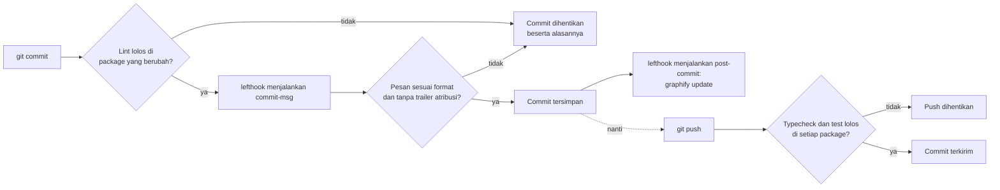
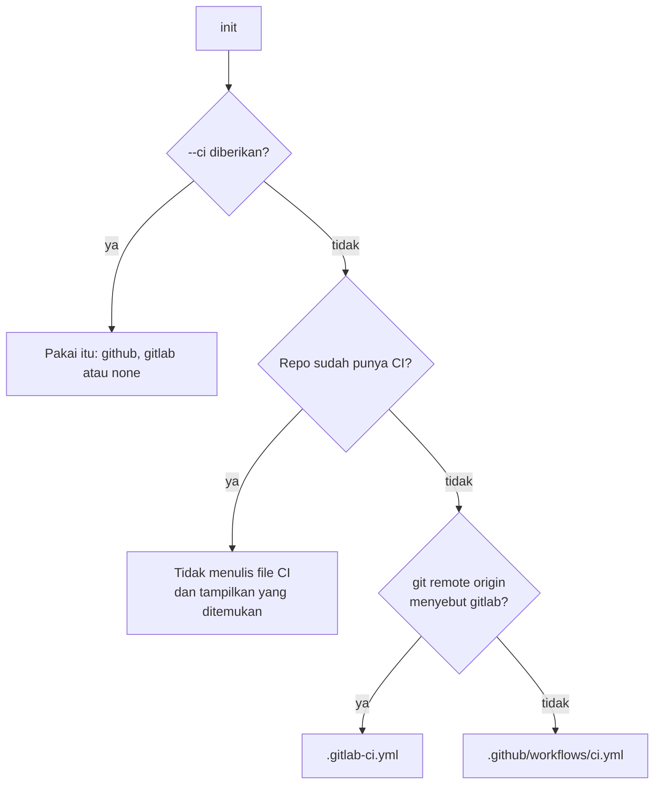
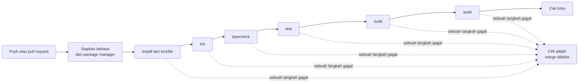

# Quality gate (git hook)

## Singkatnya
Quality gate adalah pengecekan otomatis yang menghentikan perubahan kalau melanggar aturan yang sudah disepakati. agent-initiator menambahkan git hook untuk bahasa pemrograman apa pun: sebelum commit kode di-lint dan pesan commit harus mengikuti format project; sebelum push type check dan test harus lolos; dan peta kode yang dipakai AI assistant diperbarui setelah setiap commit. Hook dijalankan oleh lefthook, satu tool kecil yang bekerja sama untuk JavaScript, Python, Go dan lainnya. Cek yang sama dijalankan lagi di GitHub untuk setiap pull request, jadi apa pun yang lolos dari cek di laptop tetap tidak bisa di-merge.

## Apa yang berjalan dan kapan

| Saat | Pengecekan | Menghentikan? |
|------|------------|---------------|
| `pre-commit` (sebelum commit dibuat) | Command `lint` milik package. Di repo multi-package setiap package punya cek sendiri, dijalankan di dalam package itu dan hanya kalau ada file staged di dalamnya. | commit |
| `commit-msg` (setelah Anda menulis pesan) | Header berupa `type(#123): subject` atau `type(TASK-123): subject`, subject maksimal 72 karakter, tanpa trailer `Co-Authored-By`. Pesan buatan git sendiri (`Merge …`, `Revert …`) lolos. | commit |
| `pre-push` (sebelum commit dikirim) | Command `typecheck` dan `test` milik setiap package, masing-masing dijalankan di dalam package-nya | push |
| `pre-push` | `check-wiki.sh`: pengingat kalau kode berubah tapi `docs/wiki/en/` tidak ([detail](wiki-knowledge-base.md#pengingat-kalau-wiki-terlupa)) | tidak pernah (hanya peringatan) |
| `post-commit` (setelah commit tersimpan) | `graphify update .` memperbarui graph kode, hanya kalau graphify termasuk tool wajib | tidak pernah |

Command-nya sama dengan yang tercantum di AGENTS.md, tanpa awalan `rtk` (hook juga berjalan untuk orang yang tidak memakai rtk). Package tanpa command `lint`, `typecheck` atau `test` tidak mendapat cek untuk itu. `format` sengaja tidak dimasukkan: banyak script format menulis ulang file, dan hook tidak boleh mengubah kode Anda diam-diam. lefthook tidak menyaring command pre-push berdasarkan file yang berubah, jadi setiap package dicek sebelum push, seperti di CI.

Dengan kata-kata: saat Anda commit, lefthook pertama menjalankan lint di package yang Anda ubah, lalu `check-message.sh` pada pesan Anda. Pesan yang salah menghentikan commit dan menampilkan format yang diharapkan. Pesan yang benar disimpan, lalu graph kode diperbarui oleh hook; langkah itu tidak pernah menggagalkan commit. Saat push, typecheck dan test harus lolos dulu. Tidak ada yang boleh melewati hook dengan `--no-verify`: AGENTS.md mencantumkannya di NEVER.

## Apa yang dibuat oleh init
- `lefthook.yml` — daftar hook (di-render, karena cek bergantung pada package dan command yang terdeteksi, dan langkah graphify pada tool wajib).
- `.lefthook/commit-msg/check-message.sh` dan `.lefthook/pre-push/check-wiki.sh` — `sh` POSIX biasa, jadi tidak butuh Node, Python atau Go.
- AGENTS.md: lefthook di Required tooling (instal lewat npm, uv, go atau brew), satu baris di Project knowledge, dan entri NEVER.

## Mengaktifkan hook
Hook ada di `.git/` dan tidak ikut di-commit, jadi setiap clone menjalankan `lefthook install` sekali. `init` menjalankannya untuk Anda (bahkan dengan `--yes`) di dalam repo git kalau lefthook sudah terinstal, kecuali ada `.husky/` atau `.pre-commit-config.yaml`: repo seperti itu sudah punya pengelola hook, dan init hanya mencetak perintahnya. Perintah ini berjalan setelah file ditulis, karena `lefthook install` tanpa `lefthook.yml` menulis config bawaan lefthook sendiri. Kalau repo sudah punya `lefthook.yml`, init mempertahankannya dan mencetak blok `commit-msg` untuk ditambahkan manual.

Urutan penting bersama graphify: jalankan `graphify hook install` dulu, lalu `lefthook install`. lefthook memindahkan hook post-commit graphify (ke `post-commit.old`) dan menjalankan graphify dari `lefthook.yml`. Kalau urutannya terbalik, graphify menambahkan dirinya ke hook lefthook dan graph dibangun dua kali per commit. Karena itu `doctor` mengecek hook post-checkout graphify, yang tidak disentuh lefthook.

## CI di GitHub Actions atau GitLab CI
`init` juga menulis pipeline CI, kecuali repository sudah punya. Mana yang ditulis:

Dengan kata-kata: `--ci github|gitlab|none` selalu menentukan. Tanpa itu, init mencari CI yang sudah ada (`.github/workflows/*.yml`, `.gitlab-ci.yml`, `.circleci/config.yml`, `Jenkinsfile`, `azure-pipelines.yml`, `bitbucket-pipelines.yml`, `.travis.yml`). Kalau ada, init tidak menulis file CI, supaya cek yang sama tidak berjalan dua kali, dan meminta Anda memastikan CI Anda menjalankan lint → typecheck → test → build → audit dengan command AGENTS.md. Kalau tidak ada, remote `origin` yang menentukan: URL yang mengandung "gitlab" (gitlab.com atau server gitlab sendiri) mendapat GitLab CI, selain itu (atau belum ada remote) mendapat GitHub Actions. File yang sudah ada tidak pernah ditimpa, bahkan dengan `--ci`.

GitHub Actions berjalan di setiap push ke `main`/`master` dan setiap pull request; GitLab CI berjalan di setiap merge request dan setiap push ke branch default. Keduanya punya satu job per package:

Dengan kata-kata: setiap job menyiapkan bahasanya (Node.js LTS, Bun, uv, Python 3 atau versi Go di `go.mod`), meng-install persis seperti yang tertulis di lockfile (`npm ci`, `pnpm install --frozen-lockfile`, `uv sync --locked`, …), lalu menjalankan cek sesuai urutan di rule quality-gates. Package tanpa command untuk sebuah langkah melewati langkah itu. Command-nya sama dengan yang tercantum di AGENTS.md, jadi hasil hijau di mesin Anda memperkirakan hasil hijau di CI.

Detail yang perlu diketahui:
- **Izin (GitHub):** workflow hanya bisa membaca kode (`permissions: contents: read`).
- **Monorepo:** setiap package berjalan di folder-nya sendiri; package workspace JavaScript meng-install dari root repo, tempat lockfile bersama berada.
- **pnpm dan yarn** dipasang dengan corepack, yang membaca `packageManager` di `package.json`. Tanpa field itu CI memakai versi terbaru, yang bisa menolak lockfile Anda, jadi `init` meminta Anda mem-pin-nya: `npm pkg set packageManager=pnpm@$(pnpm -v)`.
- **Audit** hanya gagal untuk advisory high dan critical (`--audit-level high` untuk npm, pnpm dan bun; `yarn audit` biasa untuk yarn). Go memakai `go run …govulncheck@latest`, jadi tidak ada yang perlu di-install; di CI perintah ini berjalan dengan `GOTOOLCHAIN=auto` karena govulncheck terbaru bisa membutuhkan Go yang lebih baru daripada modulnya.
- **Pengingat wiki:** pull request dan merge request juga mendapat job `wiki check (warning only)` yang menjalankan `check-wiki.sh` pada commit di request itu. Job ini tidak pernah memblokir merge: GitHub menampilkan anotasi peringatan, GitLab menampilkan "passed with warnings".
- **Image GitLab:** `node:lts`, `oven/bun:1`, `python:3` (uv atau poetry dipasang dengan pip) dan `golang:1`.
- **Izin:** di GitLab, izin job berasal dari pengaturan project; file yang dibuat tidak menambah apa pun.

## Letaknya di kode
| Apa | File |
|-----|------|
| Renderer daftar hook | `src/render/lefthook.ts` |
| Task mana berjalan di hook mana, per package | `hookChecks` di `src/generate.ts`, command dari `packageTaskCommands` di `src/render/commands.ts` |
| Cek pesan commit | `presets/base/files/.lefthook/commit-msg/check-message.sh` |
| Pengingat wiki (pre-push dan CI) | `presets/base/files/.lefthook/pre-push/check-wiki.sh` |
| `lefthook.yml` masuk ke output | `src/generate.ts` |
| Langkah setup `lefthook install` dan aturan lewatinya | `src/setup.ts` |
| Entri tool (instal, cara pakai) | `src/tooling.ts` |
| Renderer workflow CI (action dan versinya) | `src/render/github-ci.ts` |
| Renderer GitLab CI (image) | `src/render/gitlab-ci.ts` |
| CI mana yang ditulis: --ci, CI yang sudah ada, git remote | `src/detect/ci.ts` |
| Job CI per package, command install lockfile, catatan pin | `ciJobs` di `src/generate.ts` |
| Teks rule | `presets/base/rules/ci-quality-gates.md` |

## Cara mengetesnya
`rtk test pnpm vitest run test/lefthook.test.ts test/setup.test.ts test/github-ci.test.ts test/gitlab-ci.test.ts test/check-wiki.test.ts`. Untuk mengecek sintaks workflow hasil generate: `go run github.com/rhysd/actionlint/cmd/actionlint@latest .github/workflows/ci.yml`; untuk GitLab, validasi `.gitlab-ci.yml` dengan JSON schema GitLab (`app/assets/javascripts/editor/schema/ci.json` di repo gitlab) atau pakai halaman CI Lint project. Test pesan menjalankan script aslinya dengan `sh`, jadi mencakup regex yang sama persis dengan yang dipakai git.
