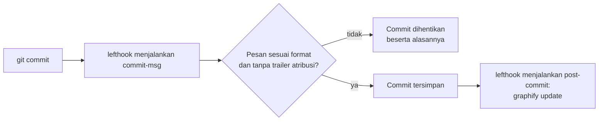

# Quality gate (git hook)

## Singkatnya
Quality gate adalah pengecekan otomatis yang menghentikan perubahan kalau melanggar aturan yang sudah disepakati. agent-initiator menambahkan git hook yang berjalan di setiap commit, untuk bahasa pemrograman apa pun: pesan commit harus mengikuti format project, dan peta kode yang dipakai AI assistant diperbarui. Hook dijalankan oleh lefthook, satu tool kecil yang bekerja sama untuk JavaScript, Python, Go dan lainnya.

## Apa yang berjalan dan kapan

| Saat | Pengecekan | Menghentikan commit? |
|------|------------|----------------------|
| `commit-msg` (setelah Anda menulis pesan) | Header berupa `type(#123): subject` atau `type(TASK-123): subject`, subject maksimal 72 karakter, tanpa trailer `Co-Authored-By`. Pesan buatan git sendiri (`Merge …`, `Revert …`) lolos. | ya |
| `post-commit` (setelah commit tersimpan) | `graphify update .` memperbarui graph kode, hanya kalau graphify termasuk tool wajib | tidak pernah |

Dengan kata-kata: saat Anda commit, lefthook menjalankan `check-message.sh` pada pesan Anda. Pesan yang salah menghentikan commit dan menampilkan format yang diharapkan. Pesan yang benar disimpan, lalu graph kode diperbarui oleh hook; langkah itu tidak pernah menggagalkan commit. Tidak ada yang boleh melewati hook dengan `--no-verify`: AGENTS.md mencantumkannya di NEVER.

## Apa yang dibuat oleh init
- `lefthook.yml` — daftar hook (di-render, karena langkah graphify bergantung pada tool wajib).
- `.lefthook/commit-msg/check-message.sh` — `sh` POSIX biasa, jadi tidak butuh Node, Python atau Go.
- AGENTS.md: lefthook di Required tooling (instal lewat npm, uv, go atau brew), satu baris di Project knowledge, dan entri NEVER.

## Mengaktifkan hook
Hook ada di `.git/` dan tidak ikut di-commit, jadi setiap clone menjalankan `lefthook install` sekali. `init` menjalankannya untuk Anda (bahkan dengan `--yes`) di dalam repo git kalau lefthook sudah terinstal, kecuali ada `.husky/` atau `.pre-commit-config.yaml`: repo seperti itu sudah punya pengelola hook, dan init hanya mencetak perintahnya. Perintah ini berjalan setelah file ditulis, karena `lefthook install` tanpa `lefthook.yml` menulis config bawaan lefthook sendiri. Kalau repo sudah punya `lefthook.yml`, init mempertahankannya dan mencetak blok `commit-msg` untuk ditambahkan manual.

Urutan penting bersama graphify: jalankan `graphify hook install` dulu, lalu `lefthook install`. lefthook memindahkan hook post-commit graphify (ke `post-commit.old`) dan menjalankan graphify dari `lefthook.yml`. Kalau urutannya terbalik, graphify menambahkan dirinya ke hook lefthook dan graph dibangun dua kali per commit. Karena itu `doctor` mengecek hook post-checkout graphify, yang tidak disentuh lefthook.

## Letaknya di kode
| Apa | File |
|-----|------|
| Renderer daftar hook | `src/render/lefthook.ts` |
| Cek pesan commit | `presets/base/files/.lefthook/commit-msg/check-message.sh` |
| `lefthook.yml` masuk ke output | `src/generate.ts` |
| Langkah setup `lefthook install` dan aturan lewatinya | `src/setup.ts` |
| Entri tool (instal, cara pakai) | `src/tooling.ts` |
| Teks rule | `presets/base/rules/ci-quality-gates.md` |

## Cara mengetesnya
`rtk test pnpm vitest run test/lefthook.test.ts test/setup.test.ts`. Test pesan menjalankan script aslinya dengan `sh`, jadi mencakup regex yang sama persis dengan yang dipakai git.
