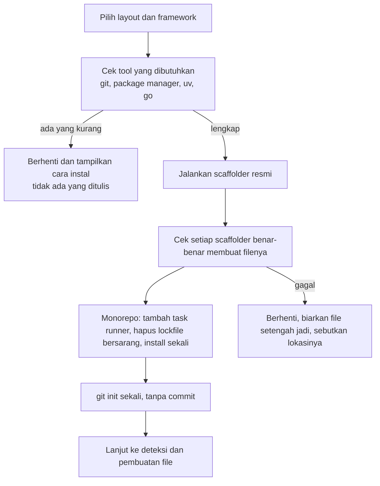

# Scaffolding project baru

## Singkatnya
Kalau foldernya kosong atau belum ada, agent-initiator bisa membuat project-nya dulu — memakai tool setup resmi setiap framework — baru kemudian menulis instruksi AI. Didukung: app tunggal, folder frontend + backend, dan monorepo (Turborepo, Nx, moon, workspaces biasa).

## Cara kerjanya

Dengan kata-kata: setelah Anda memilih layout dan framework, tool mengecek program yang dibutuhkan sudah terinstal. Lalu scaffolder resmi dijalankan, hasilnya dicek (sebagian scaffolder keluar dengan sukses meskipun gagal), setup monorepo diselesaikan, `git init` dijalankan sekali tanpa commit, dan instruksi AI dibuat dari hasil yang sebenarnya.

## Layout dan scaffolder
| Layout | Root | App |
|--------|------|-----|
| `single` | — | scaffolder framework di root |
| `folders` | folder biasa | setiap app di foldernya sendiri, misalnya `web/` dan `api/` |
| `turborepo` | file root + `turbo` | app di `apps/<nama>` |
| `nx` | `create-nx-workspace` | generator Nx (Vitest), framework lain sebagai folder biasa |
| `moonrepo` | file root, `.moon/workspace.yml`, `@moonrepo/cli` | app di `apps/<nama>`, masing-masing dengan `moon.yml` |
| `workspaces` | file root | app di `apps/<nama>` |

Framework: `nextjs`, `react-vite`, `vue-vite`, `nuxt`, `nestjs`, `express` (template TypeScript minimal), `fastify`, `hono`, `fastapi` dan `django` (uv), `go-http` (go + Gin).

## Catatan moonrepo
- moon tidak membaca script package.json, jadi setiap app mendapat `moon.yml` yang memetakan `build`, `test` dan `lint` ke command sebenarnya.
- moon butuh minimal satu commit git dan versi tool yang di-pin (`moon setup`) sebelum `moon run` bisa jalan. Tool ini mengingatkan setelah scaffolding, karena tidak pernah commit untuk Anda.

## Keamanan
- Hanya folder baru atau kosong yang di-scaffold.
- Variabel deteksi agent (`CLAUDECODE`, `OPENCODE`) dihapus supaya scaffolder berperilaku seperti di terminal biasa; file agent milik Nx dihapus tetapi skill resminya dipertahankan.

## Letaknya di kode
`src/scaffold/recipes.ts` (daftar langkah, pure), `src/scaffold/run.ts` (menjalankan langkah), `src/scaffold/index.ts` (pengecekan, git init, catatan), `src/scaffold/templates.ts`, `src/scaffold/frameworks.ts`, `src/scaffold/flags.ts`.

## Cara mengeceknya
Unit test: `rtk test pnpm vitest run test/scaffold.test.ts test/run.test.ts`. Perubahan scaffolder juga wajib diuji dengan smoke test sungguhan di folder sementara, karena flag scaffolder berubah antar versi.
