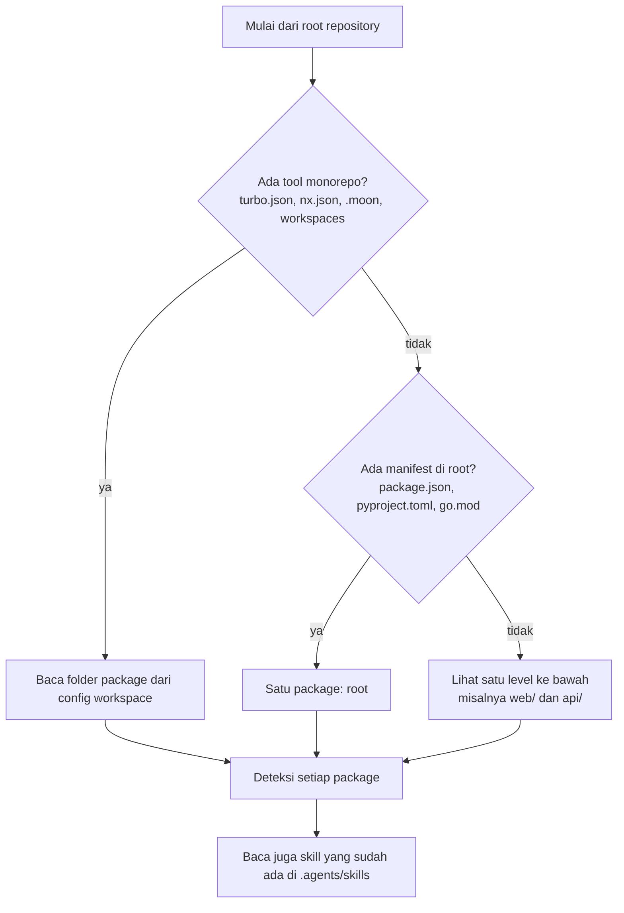

# Deteksi stack

## Singkatnya
Sebelum menulis apa pun, agent-initiator melihat file-file di repository untuk mengetahui dibangun dengan apa: bahasa, framework, package manager dan tool monorepo yang dipakai. Hasilnya menentukan aturan dan command yang diterima AI assistant.

## Cara kerjanya

Dengan kata-kata: pertama cari tool monorepo; kalau ada, config-nya berisi daftar folder package. Kalau tidak, manifest di root berarti repository satu package. Kalau tidak ada juga, setiap sub-folder yang punya manifest menjadi package (misalnya `web/` dan `api/` di repository fullstack). Setiap package lalu dideteksi sendiri-sendiri.

## Yang dideteksi per package
| Tanda | Hasil |
|-------|-------|
| `next`, `nuxt`, `react`+`vite`, `vue`+`vite` di package.json | preset `nextjs`, `nuxt`, `react-vite`, `vue-vite` |
| `@nestjs/core`, `express`, `fastify`, `hono` | preset `nestjs`, `express`, `fastify`, `hono` |
| dependency `typescript` atau `tsconfig.json` | `typescript`, kalau tidak `node` |
| `pyproject.toml` atau `requirements.txt` yang menyebut FastAPI atau Django | `python` ditambah `fastapi` atau `django` |
| Tanpa manifest, tetapi ada file `.py` atau `tests/test_*.py` di root repository | `python`, hanya dengan command build (`python3 -m compileall`) dan test: `python3 -m pytest` kalau test-nya mengimpor pytest, selain itu `python3 -m unittest discover`. Tidak ada yang mendeklarasikan dependency, jadi tidak ada command install, lint, typecheck atau audit. Hanya root yang dihitung, jadi folder `scripts/` berisi file `.py` di stack lain bukan package. |
| `go.mod` (ditambah gin, echo, chi atau fiber) | `go` (ditambah `go-http`) |
| Lockfile (`pnpm-lock.yaml`, `yarn.lock`, `bun.lock`, `uv.lock`, `poetry.lock`, …) | package manager |
| Script di `package.json` | command sebenarnya yang ditampilkan di AGENTS.md |

## Tool monorepo
| Tool | Dideteksi dari | Catatan |
|------|----------------|---------|
| Turborepo | `turbo.json` | folder package dari pnpm-workspace.yaml atau `workspaces` di package.json |
| Nx | `nx.json` | project Nx tanpa script mendapat command `nx run <project>:<task>` |
| moonrepo | `.moon/` atau `.config/moon/` | folder dari `.moon/workspace.yml`; command memakai ID project moon (key map atau nama folder), bukan nama di package.json |
| Workspaces biasa | pnpm-workspace.yaml atau `workspaces` di package.json | — |

## Letaknya di kode
`src/detect/index.ts` (urutan pengecekan), `node.ts`, `python.ts`, `go.ts`, `workspace.ts`, `package-manager.ts`, `skills.ts`.

## Cara mengeceknya
`rtk test pnpm vitest run test/detect.test.ts` — satu fixture per stack ada di `test/fixtures/`.
