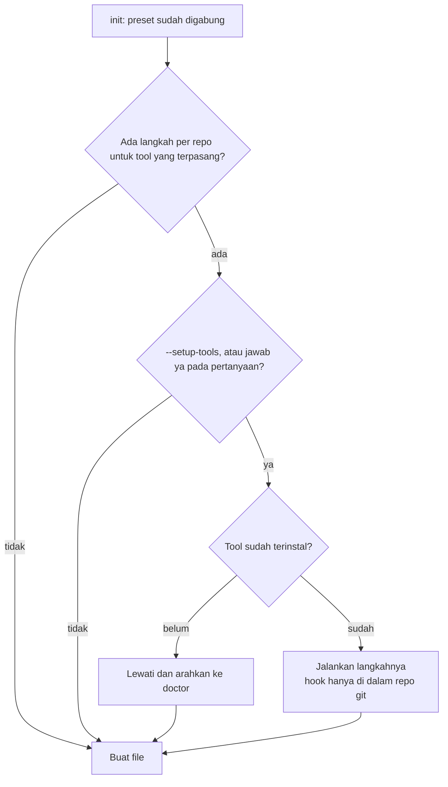

# Tool opsional, doctor dan setup per repository

## Singkatnya
agent-initiator mengenal lima tool pendukung. Semuanya opsional: `init` mengecek mana yang terpasang di komputer, dan hanya itu yang masuk ke instruksi, lalu menjadi wajib di sana. Tool yang tidak terpasang tidak disebut sama sekali, jadi mesin baru mendapat command polos tanpa ada yang perlu diinstal. Sebagian besar tool cukup diinstal sekali per komputer; dua di antaranya juga butuh langkah kecil di setiap repository, yang bisa dijalankan agent-initiator. Tool ini tidak pernah menginstal apa pun sendiri.

## Tool-tool tersebut
Apa yang berubah kalau sebuah tool terpasang: rtk menambah awalannya di setiap command di AGENTS.md dan di perintah shell yang ditulis di skill dan rule (preset menuliskannya sebagai `{{rtk}}git status`, yang diisi oleh `init`; skill yang merujuk command AGENTS.md meminta menjalankannya persis seperti tertulis di sana). Setiap bentuk rtk dipakai sesuai kegunaannya: `rtk test` untuk test (hanya kegagalan yang tampil), `rtk err` untuk build dan cek (hanya error yang tampil), `rtk proxy` untuk command AGENTS.md lainnya (dijalankan apa adanya; `rtk <tool>` tidak dipakai di sana karena sebagian filter rtk hanya menerima subcommand tertentu, misalnya `rtk pip install -r …` gagal), dan `rtk <perintah>` di skill dan rule, yang hanya menandai perintah git, nx, turbo dan moon yang memang bisa begitu. Karena AGENTS.md dibuat di satu mesin dan dibaca di mesin lain, bagian Required tooling juga meminta agent mengecek sekali per sesi tool mana yang ada (`command -v rtk graphify`) dan, kalau ada yang tidak terpasang, melewati instruksinya alih-alih mencoba berulang; untuk rtk dengan membuang awalannya; graphify menambah baris graphify di Project knowledge, `.graphifyignore` dan setup graph; setiap tool yang terpasang mendapat satu baris cara pakai di AGENTS.md → Required tooling dan langkah instalnya di `.agents/rules/required-tooling.md`.

| Tool | Untuk apa | Setelah instal sekali | Langkah per repository |
|------|-----------|-----------------------|------------------------|
| rtk | memperpendek output command | otomatis (hook global) | tidak ada |
| caveman | jawaban assistant yang singkat | otomatis di Claude Code | tidak ada |
| ponytail | kode paling kecil yang berfungsi | otomatis di Claude Code | tidak ada |
| graphify | peta kode yang bisa dicari | skill tersedia | `graphify update .`, opsional `graphify hook install` |
| UI UX Pro Max (frontend saja) | panduan desain | CLI tersedia | `uipro init --ai universal` dan `--ai claude` |

## Cara kerja setup

Dengan kata-kata: setelah preset diketahui, tool mendaftar langkah per repository. Langkah itu dijalankan dengan `--setup-tools` atau kalau Anda setuju saat ditanya. Di mode `--yes` tanpa `--setup-tools`, hanya git hook graphify yang dijalankan, dan hanya kalau `.gitattributes` belum ada (graphify menambahkan baris ke file itu, dan file yang sudah ada tidak pernah diubah tanpa bertanya); kalau sudah ada, tool mencetak perintahnya untuk Anda jalankan sendiri. Tool yang belum terinstal dilewati (tidak pernah diinstal), git hook hanya dipasang di dalam repository git, dan langkah yang gagal hanya memunculkan peringatan tanpa menghentikan `init`. Setup berjalan sebelum file dibuat supaya skill UI UX Pro Max terdaftar di AGENTS.md.

## Memakai graphify dengan hemat
- `graphify update .` membangun graph dari kode saja (tanpa LLM, tanpa token); git hook menjaganya tetap mutakhir.
- Ekstraksi penuh `/graphify` membaca dokumen dengan LLM dan mahal; jalankan hanya sesekali, karena wiki bahasa Inggris sudah menjelaskan konsepnya.
- Bertanya dengan nama simbol dan budget: `graphify affected "detectWorkspace"` menampilkan apa yang tersentuh sebuah perubahan dalam sekitar 140 token; `graphify path "runInit" "moonProjectConfig"` menampilkan rantai panggilan dalam satu baris. Pertanyaan umum menghasilkan noise.
- `.graphifyignore` (dibuat oleh `init`) mengeluarkan `docs/wiki/id/` dan log perubahan dari graph.

## Doctor
`agent-initiator doctor` menampilkan centang (terpasang) atau lingkaran kosong (opsional, belum terpasang) per tool, beserta command instal untuk yang belum ada. Tool yang tidak ada bukan error, jadi exit code tetap 0. Di dalam repository git, doctor juga menampilkan apakah git hook graphify sudah terpasang; hook yang belum terpasang hanya peringatan, karena clone di CI memang tidak pernah punya hook.

Setelah meng-clone repository, setiap kontributor menjalankan `graphify hook install` sekali (hook ada di `.git/` dan tidak ikut di-commit). Halaman getting-started hasil generate dan AGENTS.md → Project knowledge sama-sama menyebutkannya.

## Letaknya di kode
`src/tooling.ts` (daftar tool dan teksnya: baris cara pakai masuk ke AGENTS.md, tujuan dan langkah instal ke rule hasil generate `.agents/rules/required-tooling.md` lewat `src/render/tooling-rule.ts`), `src/setup.ts` (langkah per repo), `src/doctor.ts` (cek mesin), dan `withRtk`/`fillRtkCommands` di `src/render/commands.ts` (bentuk-bentuk rtk).

## Cara mengeceknya
`rtk test pnpm vitest run test/setup.test.ts`.
