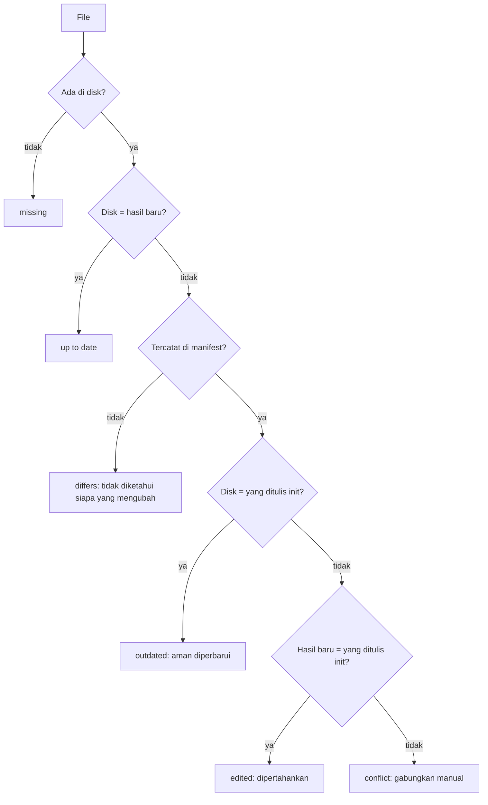

# Status dan upgrade: menjaga repository tetap mutakhir

## Singkatnya
`agent-initiator status` memberi tahu file mana hasil `init` yang sudah tertinggal dari versi yang Anda pakai sekarang, tanpa mengubah apa pun. Perintah ini bisa membedakan file yang tidak disentuh siapa pun (aman diperbarui) dari file yang sudah diedit seseorang (dipertahankan), karena `init` mencatat sidik jari setiap file yang ditulisnya. Exit code-nya 1 kalau ada yang perlu ditindaklanjuti, jadi bisa juga dijalankan di CI. Setelah itu `agent-initiator init --upgrade` memperbarui tepat file yang tidak diedit siapa pun dan menambah file yang hilang; file yang sudah diedit tidak pernah ditimpa.

## Cara kerjanya
`init` menulis `.agents/agent-initiator.json` (lihat [file yang dibuat](generated-files.md)) berisi hash `sha256` setiap file yang ditulisnya. `status` membuat ulang semuanya di memori, memakai tanggal dan tool yang tercatat di manifest supaya perbandingannya setara, lalu membandingkan tiga hal per file: apa yang ditulis init (A), apa yang ada di disk (B) dan apa yang dihasilkan versi ini (C). Nomor versi saja tidak cukup: isinya bisa berubah walaupun versinya sama.

Dengan kata-kata: file yang hilang dilaporkan lebih dulu. File yang sudah sama dengan hasil baru berarti up to date, siapa pun yang mengubahnya. Tanpa catatan (file yang sudah dimiliki pengguna, atau repository yang disiapkan sebelum manifest ada) yang bisa diketahui hanya "sama atau berbeda". Dengan catatan, file yang tidak disentuh menjadi outdated kalau template berubah, file yang diedit dipertahankan kalau template tidak berubah, dan file yang berubah di kedua sisi adalah konflik. File yang tercatat di manifest tetapi tidak lagi dibuat versi ini (misalnya `lefthook.yml` lama) dilaporkan sebagai obsolete; tidak ada yang dihapus.

**Wiki tidak ikut dibandingkan.** Halaman di bawah `docs/wiki/` ditulis sekali oleh `init` (hanya kalau belum ada) lalu menjadi milik tim Anda: kerangka yang lebih baru tidak berarti apa-apa untuk halaman yang sudah Anda isi, dan halaman yang Anda hapus atau gabungkan tidak boleh muncul lagi. Karena itu `status` dan `init --upgrade` melewati `docs/wiki/` sepenuhnya dan menyebutkannya ("Not compared: docs/wiki/"); manifest tetap mencatat apa yang ditulis init.

| Status | Arti | Exit code |
|--------|------|-----------|
| up to date | sama dengan hasil versi ini | 0 |
| edited | Anda mengubahnya; template tidak | 0 |
| differs | tidak ada catatan apa yang ditulis init | 0 |
| obsolete | tidak lagi dibuat; periksa dan hapus sendiri | 0 |
| outdated | tidak Anda sentuh; template berubah | 1 |
| conflict | diubah oleh Anda dan oleh template | 1 |
| missing | dibuat tetapi tidak ada di disk | 1 |

Untuk file outdated, conflict dan differs, `status` menulis isi barunya ke folder temp di luar repository dan mencetak perintah `git diff --no-index -- <file> <baru>` untuk melihat perbedaannya. Tool yang dipasang setelah init dicantumkan tetapi tidak ikut dibandingkan. Versi agent-initiator yang baru selalu menampilkan AGENTS.md hasil generate sebagai outdated (atau konflik, kalau sudah diedit), karena penanda di baris pertamanya menyebut versi.

## Upgrade
`agent-initiator init --upgrade` (tambahkan `--dry-run` untuk melihat rencananya dulu) memakai perbandingan yang sama dan:
- menulis file **outdated** dengan isi baru dan membuat file yang **missing**;
- membiarkan file **edited**, **conflict** dan **differs**, lalu mencetak perintah `git diff` untuk masing-masing supaya bisa digabung manual; file **obsolete** hanya dicantumkan;
- mengecek ulang setiap file outdated tepat sebelum menulisnya dan melewatinya kalau berubah sejak perbandingan;
- memperbarui manifest: `version` baru, tanggal `upgradedAt` dan hash baru untuk file yang ditulis. `generatedAt` tetap, karena isi yang dibuat (kerangka log wiki) membawa tanggal itu dan perbandingan berikutnya harus tetap membuat ulang dengannya.

Tanpa manifest (repository yang disiapkan sebelum manifest ada) tidak ada yang bisa dibedakan dari file yang diedit, jadi hanya file yang hilang yang ditambahkan; untuk mulai dilacak, backup file agent lalu jalankan `init` lagi. Isi dibuat dengan tool yang tercatat di manifest; tool yang dipasang belakangan dicantumkan tetapi tidak ditambahkan (backup lalu jalankan `init` lagi untuk memasukkannya).

## Letaknya di kode
| Apa | File |
|-----|------|
| Perbandingan tiga arah; file yang tidak dibandingkan (`SEED_ONCE_PREFIXES`) | `classifyFiles`, `isSeedOnce` di `src/status.ts` |
| Perintah `status` dan `init --upgrade` (perbandingan bersama) | `compareRepository`, `runStatus`, `runUpgrade` di `src/cli.ts` |
| File mana yang ditulis upgrade; penulisan yang aman | `upgradeFiles` di `src/status.ts`, `applyUpgrade` di `src/write/index.ts` |
| Manifest setelah upgrade | `upgradeManifest` di `src/render/manifest.ts` |
| Membaca dan mengecek manifest | `readManifest` di `src/detect/initialised.ts` |
| Hash | `contentHash` di `src/render/manifest.ts` |

## Cara mengetesnya
`rtk test pnpm vitest run test/status.test.ts test/write.test.ts test/cli.e2e.test.ts`. Manual: `agent-initiator init <dir> --yes`, lalu `agent-initiator status <dir>` (semua up to date), edit sebuah rule lalu jalankan lagi.
