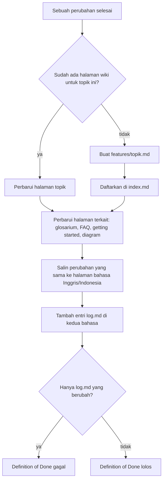

# Wiki sebagai knowledge base

## Singkatnya
Setiap project yang disiapkan agent-initiator punya wiki dalam bahasa Inggris dan Indonesia. Wiki ini menjelaskan project supaya siapa pun — developer baru, developer berpengalaman, atau orang yang tidak menulis kode — bisa memahaminya tanpa harus bertanya. Setiap ada perubahan, halaman tentang topik itu ikut diperbarui, sehingga wiki tidak pernah tertinggal dari kode.

## Cara kerjanya

Dengan kata-kata: saat sebuah perubahan selesai, agent mencari halaman wiki tentang topik itu. Kalau belum ada, agent membuatnya dan mendaftarkannya di `index.md`. Lalu agent memperbarui halaman terkait, menyamakan semuanya ke dua bahasa, dan menambah entri log. Kalau yang berubah hanya log, Definition of Done tidak lolos.

## Rule dan skill
- Rule `documentation` (di `.agents/rules/`) memberi tahu AI agent dan manusia cara menulis dan merawat wiki:
  - setiap halaman dibuka dengan bagian **In short** (Singkatnya) berbahasa sehari-hari, lalu detail untuk developer;
  - wiki punya struktur tetap: `index`, `overview`, `getting-started`, `architecture`, `features/<topik>`, `glossary`, `faq`, `adr/` dan `log`;
  - **setiap perubahan memperbarui halaman topik yang disentuhnya**; kalau halamannya belum ada, dibuat `features/<topik>.md` baru. Entri log saja tidak pernah cukup;
  - halaman yang menjelaskan alur, proses, atau arsitektur diberi diagram — Mermaid sebagai bawaan, ASCII untuk alur sederhana.
- Wiki juga ditulis untuk AI agent: mereka cukup membaca halaman bahasa Inggris, mulai dari tabel task → halaman di `index.md`, dan memakai tabel "Letaknya di kode" untuk langsung ke file. Bagian Project knowledge di AGENTS.md mengarahkan mereka ke sini sebelum menjelajah kode.
- Skill `update-wiki` adalah alur langkah demi langkah: cari atau buat halaman topik, perbarui halaman terkait (glosarium, FAQ, getting started), samakan versi Inggris ke Indonesia, perbarui `index.md`, tambahkan entri `log.md`.
- Definition of Done (di `AGENTS.md` dan skill `definition-of-done`) tidak lolos kalau yang diperbarui hanya log.
- `agent-initiator init` membuat halaman awal dalam dua bahasa (hanya kalau belum ada): `index` dengan jalur baca untuk non-developer, developer baru dan developer berpengalaman, `overview`, `getting-started`, `architecture` dengan contoh diagram Mermaid, `glossary`, `faq` dan `log`. Setiap halaman dibuka dengan *Singkatnya* dan menjelaskan apa yang perlu ditulis di sana.

## Letaknya di kode
| Apa | Di mana |
|-----|---------|
| Teks rule | `presets/base/rules/documentation.md` |
| Alur kerja | `presets/base/skills/update-wiki/SKILL.md` |
| Baris Definition of Done di AGENTS.md hasil generate | `src/render/agents-md.ts` (`dodSection`) |
| Halaman awal untuk repository baru | `presets/base/files/docs/wiki/{en,id}/` |
| Guard yang menjaga aturan ini tidak hilang | `test/requirements.test.ts` |
| Guard untuk wiki repository ini sendiri (pasangan bahasa, Singkatnya, index, diagram) | `test/wiki.test.ts` |

## Cara mengeceknya
Jalankan `rtk test pnpm run test` — test requirement gagal kalau rule, skill, atau Definition of Done kehilangan syarat "halaman topik, bukan hanya log".
