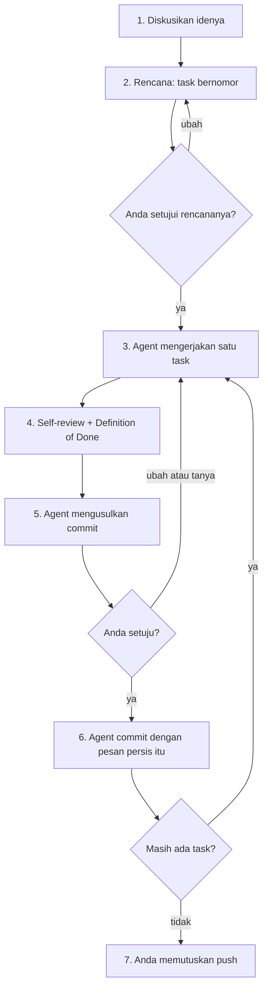

# Alur kerja manusia–agent

## Singkatnya
Rule dan skill yang dibuat agent-initiator membuat AI agent bekerja dalam putaran yang tetap: diskusi, rencana, kerjakan satu task, cek, minta persetujuan, commit, lalu task berikutnya. Agent yang mengerjakan; manusia yang memutuskan apa yang dibuat, menyetujui rencana dan menyetujui setiap commit dan push. Halaman ini menjelaskan putaran itu dan rule atau skill yang menggerakkan setiap langkah; [README](../../../../README.md#working-with-an-agent-the-humanagent-loop) berisi contoh task yang direncanakan dan contoh permintaan persetujuan.

## Putarannya

Dengan kata-kata: agent pertama mendiskusikan idenya dan menanyakan apa pun yang belum jelas, tanpa menulis kode. Lalu agent mengusulkan rencana berupa task kecil bernomor dengan kriteria selesai; Anda menyetujui atau mengubahnya. Untuk setiap task agent menulis kode, test, doc comment dan halaman wiki, mereview diff-nya sendiri dan menjalankan Definition of Done. Lalu agent berhenti dan menunjukkan apa yang berubah, apa yang diverifikasi dan pesan commit yang persis. Hanya setelah Anda setuju agent melakukan commit, dengan pesan persis itu, lalu lanjut ke task berikutnya. Push selalu butuh persetujuan tersendiri.

## Isi permintaan persetujuan yang baik
- Apa yang berubah, dengan kata-kata sederhana.
- Apa yang diverifikasi, dengan angka nyata: test, coverage, build, smoke run.
- Apa yang ditemukan di tengah jalan (diperbaiki atau tidak), dan apa yang tidak bisa dicek.
- File dan pesan commit yang persis: `type(TASK-n): subject`, body yang menjelaskan alasannya, tanpa trailer atribusi.

## Letaknya di kode
| Langkah | Rule atau skill | File di repository hasil generate | Sumber di repository ini |
|---------|-----------------|-----------------------------------|--------------------------|
| Diskusi | rule `llm-discipline` | `.agents/rules/llm-discipline.md` | `presets/base/rules/llm-discipline.md` |
| Rencana | skill `plan-task` | `.agents/skills/plan-task/SKILL.md` | `presets/base/skills/plan-task/` |
| Cek | skill `self-review`, `definition-of-done` | `.agents/skills/…` | `presets/base/skills/` |
| Minta persetujuan dan commit | skill `commit`, rule `git-workflow` | `.agents/skills/commit/`, `.agents/rules/git-workflow.md` | `presets/base/skills/commit/`, `presets/base/rules/git-workflow.md` |
| Baris MUST/NEVER (persetujuan, satu task = satu commit) | AGENTS.md → Constraints | `AGENTS.md` | `presets/base/preset.json` |

## Cara mengetesnya
`rtk test pnpm vitest run test/requirements.test.ts` menjaga rule dan skill yang dibutuhkan putaran ini (persetujuan sebelum commit dan push, satu task = satu commit, plan-task dengan nomor task). Putarannya sendiri dicek dengan memakainya; lihat [evaluasi](evaluation.md) untuk seberapa baik berbagai model mengikutinya.
