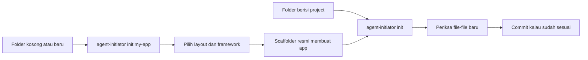

# Memulai

## Singkatnya
Cara memasang agent-initiator dari repository ini, menjalankannya pada sebuah project, dan membuat perubahan pertama pada tool ini sendiri.

## Kebutuhan
- Node.js 20 atau lebih baru dan pnpm.
- Git.
- Tool pendukung wajib yang tercantum di `AGENTS.md` (rtk, graphify, caveman, ponytail; UI UX Pro Max untuk pekerjaan frontend). `agent-initiator doctor` mengeceknya.
- Untuk scaffolding app Python atau Go: `uv` atau `go`.

## Memasang command
Package ini belum dipublish ke npm, jadi pasang dari hasil clone:

```bash
rtk git clone git@github.com:RedLucky/agent-initiator.git
cd agent-initiator
rtk pnpm install
rtk pnpm run build
pnpm setup          # sekali saja, kalau pnpm menampilkan ERR_PNPM_NO_GLOBAL_BIN_DIR
rtk pnpm link --global
```

Setelah `source ~/.bashrc` (atau membuka terminal baru), command `agent-initiator` bisa dipakai di folder mana pun. Link ini menunjuk ke hasil clone Anda, jadi setelah mengubah kode cukup jalankan `rtk pnpm run build`.

Lalu pasang git hook graphify sekali di clone Anda, supaya graph kode yang ditanyai AI agent dibangun ulang setiap kali commit:

```bash
graphify hook install    # menambah hook post-commit dan post-checkout; hook ada di .git/ dan tidak ikut di-commit
graphify hook status     # kedua hook harus berstatus installed
```

## Memakainya



```bash
cd my-existing-app && agent-initiator init           # menambahkan instruksi AI ke project yang sudah ada
agent-initiator init my-new-app                        # membuat project baru dulu (dengan pertanyaan)
agent-initiator init my-app --framework nextjs --yes   # sama, tanpa pertanyaan
agent-initiator doctor                                 # mengecek tool pendukung di mesin ini
```

`init` membuat file relatif terhadap folder tempat terminal Anda berada. Jalankan dari folder induk (atau beri path lengkap) kalau project harus berada di tempat lain.

## Test
```bash
rtk test pnpm run test            # semua test
rtk test pnpm run test:coverage   # test dengan coverage (Definition of Done butuh >= 80% pada kode yang berubah)
rtk err pnpm run typecheck
rtk err pnpm run build
```

## Perubahan pertama Anda pada tool ini
1. Rencanakan task dengan skill `plan-task` dan minta persetujuan.
2. Ubah kode dengan unit test dan doc comment berbahasa sederhana untuk setiap function.
3. Perbarui halaman wiki untuk topik yang Anda ubah (buat di `features/` kalau belum ada), dalam bahasa Inggris dan Indonesia.
4. Jalankan skill `self-review` dan `definition-of-done`.
5. Minta persetujuan, lalu commit satu task per commit dengan skill `commit`.
